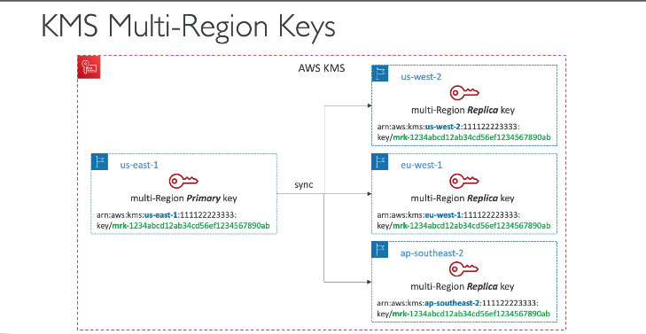
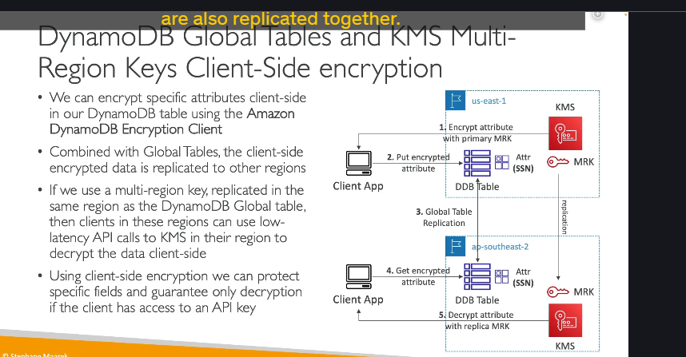
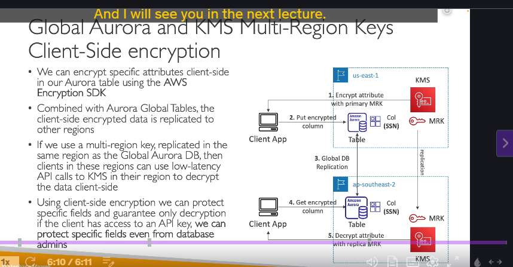

**Khóa KMS Đa Vùng là gì?**

- Khóa KMS Đa Vùng là một tập hợp các khóa KMS mà bạn có thể sử dụng **liên đổi (interchangeably)** trên **các Vùng (Region) AWS khác nhau**.
- Chúng được cấu trúc với một **Khóa Chính (Primary key)** ở một Vùng bạn chọn (ví dụ: `us-east-1`) và các **Bản sao (Replicas)** của khóa đó ở các Vùng khác.

**Đặc điểm chính:**

- **Sao chép vật liệu khóa:** Vật liệu mã hóa của khóa (key material) được sao chép đến các Vùng là bản sao. Điều này có nghĩa là cùng một khóa mã hóa tồn tại ở nhiều Vùng.
- **ID khóa giống nhau:** ID của khóa KMS Đa Vùng là **giống hệt nhau** trên tất cả các Vùng (thường bắt đầu bằng `mrk-`). Đây là điểm khác biệt quan trọng so với khóa đơn vùng thông thường.
- **Sao chép xoay vòng khóa:** Nếu bạn bật tính năng xoay vòng khóa tự động (automatic rotation) cho Khóa Chính, sự thay đổi (rotation) này cũng sẽ được sao chép đến các Vùng bản sao.

**Mục đích và Lợi ích:**

- Lợi ích chính của Khóa KMS Đa Vùng là cho phép bạn **mã hóa dữ liệu ở một Vùng và giải mã ở một Vùng khác** một cách dễ dàng.
- Điều này giúp bạn **không cần phải mã hóa lại dữ liệu** khi di chuyển nó giữa các Vùng, hoặc không cần thực hiện các lệnh gọi API xuyên Vùng (cross-Region API calls) chỉ để giải mã dữ liệu.

**Lưu ý quan trọng:**

- Khóa KMS Đa Vùng **KHÔNG phải là khóa toàn cầu (global)** về mặt quản lý.
- Mỗi khóa (Khóa Chính và các Bản sao) được **quản lý độc lập** trong Vùng của nó (ví dụ: có Chính sách khóa - Key Policy riêng cho từng bản sao).
- Khóa KMS Đa Vùng **không được khuyến nghị sử dụng cho các trường hợp phổ biến** vì KMS thường mong muốn một khóa bị ràng buộc với một Vùng duy nhất để đơn giản hóa việc quản lý và kiểm soát truy cập.

**Các Trường hợp Sử dụng Cụ thể:**

Khóa KMS Đa Vùng được thiết kế cho các tình huống cụ thể khi bạn cần tương tác với dữ liệu và khóa trên nhiều Vùng:

- **Mã hóa phía client toàn cầu (Global client-side encryption):** Mã hóa dữ liệu phía client ở một Vùng và có thể giải mã phía client ở một Vùng khác.
- **Mã hóa dữ liệu trên Bảng DynamoDB Toàn cầu (Global DynamoDB Tables):** Đặc biệt hữu ích khi bạn muốn mã hóa các **thuộc tính (attributes)** cụ thể trong bảng DynamoDB Global (chứ không chỉ mã hóa toàn bộ bảng khi nghỉ - at-rest encryption).
- **Mã hóa dữ liệu trên Aurora Toàn cầu (Global Aurora):** Tương tự, khi bạn muốn mã hóa các **cột (columns)** cụ thể trong cơ sở dữ liệu Aurora Global.

**Ví dụ Chi tiết: DynamoDB Toàn cầu và Khóa KMS Đa Vùng (với Mã hóa phía Client)**

- **Kịch bản:** Bạn có Bảng DynamoDB Global được sao chép giữa các Vùng (ví dụ: `us-east-1` và `ap-southeast-2`). Bạn muốn mã hóa các thuộc tính nhạy cảm (ví dụ: số an sinh xã hội - SSN) bằng mã hóa phía client.
- **Thiết lập:**
  - Tạo Khóa KMS Đa Vùng với Khóa Chính ở `us-east-1` và Bản sao ở `ap-southeast-2`.
  - Ứng dụng client sử dụng thư viện DynamoDB Encryption Client.
- **Quá trình:**
  1.  Ứng dụng client ở `us-east-1` muốn ghi dữ liệu vào bảng DynamoDB.
  2.  Nó sử dụng thư viện Encryption Client và Khóa KMS Đa Vùng (Khóa Chính ở `us-east-1`) để mã hóa thuộc tính SSN **trên máy client** trước khi gửi toàn bộ dữ liệu hàng đó lên DynamoDB. (Hầu hết các thuộc tính khác không mã hóa phía client).
  3.  Bởi vì bảng là Global Table, dữ liệu hàng đó (bao gồm thuộc tính SSN đã mã hóa) được **tự động sao chép** đến Vùng `ap-southeast-2`.
  4.  Một ứng dụng client ở Vùng `ap-southeast-2` đọc hàng dữ liệu đó. Nó nhận ra thuộc tính SSN đã được mã hóa (dựa vào metadata).
  5.  Ứng dụng client đó sử dụng thư viện Encryption Client và Khóa KMS Đa Vùng (Bản sao ở `ap-southeast-2`) để thực hiện lệnh gọi API **đến dịch vụ KMS LOKAL** ở Vùng `ap-southeast-2` để giải mã thuộc tính SSN.
- **Lợi ích:** Tốc độ giải mã nhanh hơn vì lệnh gọi API đến KMS để giải mã được thực hiện cục bộ trong cùng Vùng (`ap-southeast-2`), thay vì phải gọi xuyên Vùng về `us-east-1`.

tương tự
**Ví dụ Chi tiết: Aurora Toàn cầu và Khóa KMS Đa Vùng (với Mã hóa phía Client)**

- **Kịch bản:** Tương tự DynamoDB Global, nhưng với cơ sở dữ liệu Aurora Global và bạn muốn mã hóa các cột cụ thể (ví dụ: cột SSN).
- **Thiết lập:** Khóa KMS Đa Vùng được sao chép giữa các Vùng. Ứng dụng client sử dụng AWS Encryption SDK.
- **Quá trình:**
  1.  Client sử dụng Encryption SDK và Khóa KMS Đa Vùng để mã hóa cột SSN **trên máy client** trước khi chèn dữ liệu vào bảng Aurora.
  2.  Bởi vì là Aurora Global Database, dữ liệu (bao gồm cột SSN đã mã hóa) được **tự động sao chép** đến các Vùng khác.
  3.  Client ở Vùng bản sao đọc dữ liệu với cột SSN đã mã hóa.
  4.  Nó sử dụng Encryption SDK và Khóa KMS Đa Vùng (Bản sao ở Vùng Lokal) để thực hiện lệnh gọi API **đến dịch vụ KMS LOKAL** để giải mã cột đó.
- **Lợi ích:** Độ trễ thấp hơn khi giải mã do gọi API KMS cục bộ.

**Lợi ích Bảo mật Bổ sung (trong cả 2 ví dụ):**

- Sử dụng mã hóa phía client để mã hóa các thuộc tính/cột cụ thể giúp bảo vệ dữ liệu **ngay cả khỏi những người quản trị cơ sở dữ liệu (database administrators)**.
- Nếu người quản trị CSDL có quyền truy cập vào bảng/CSDL nhưng **không có quyền truy cập vào Khóa KMS** dùng để mã hóa thuộc tính/cột đó, họ sẽ không thể đọc được dữ liệu đã mã hóa.

Tóm lại, Khóa KMS Đa Vùng là tính năng nâng cao cho phép bạn sử dụng cùng một "danh tính" khóa và vật liệu khóa trên nhiều Vùng, đặc biệt hữu ích khi kết hợp với mã hóa phía client cho các dịch vụ dữ liệu toàn cầu như DynamoDB Global Tables và Aurora Global Database để đạt được hiệu suất giải mã tốt hơn và tăng cường bảo mật cho từng trường dữ liệu cụ thể.
