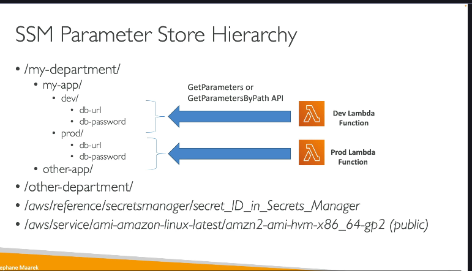
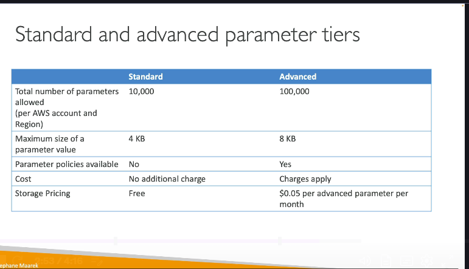
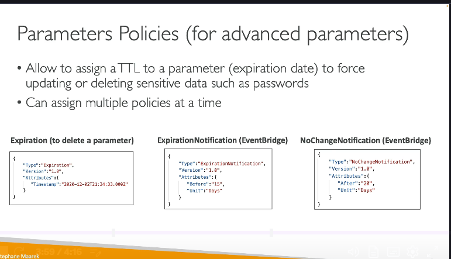

**AWS Systems Manager Parameter Store là gì?**

- Parameter Store là một dịch vụ lưu trữ **an toàn** cho cả cấu hình (configuration) và bí mật (secrets) của bạn.
- Nó cung cấp một nơi tập trung để quản lý các giá trị cấu hình, mật khẩu, chuỗi kết nối cơ sở dữ liệu, v.v.

**Các Đặc điểm và Lợi ích chính:**

- **Lưu trữ an toàn:** Cung cấp một nơi an toàn để lưu trữ dữ liệu nhạy cảm.
- **Tùy chọn Mã hóa với KMS:** Bạn có thể tùy chọn mã hóa cấu hình của mình bằng cách sử dụng dịch vụ AWS KMS. Khi được mã hóa, cấu hình đó trở thành bí mật. Điều này yêu cầu bạn phải có quyền truy cập vào khóa KMS tương ứng để mã hóa/giải mã.
- **Serverless, có khả năng mở rộng và bền vững:** Bạn không cần quản lý máy chủ cho dịch vụ này. Nó tự động mở rộng theo nhu cầu và dữ liệu của bạn được lưu trữ bền vững.
- **SDK dễ sử dụng:** Dễ dàng truy cập các tham số từ ứng dụng của bạn bằng AWS SDK.
- **Theo dõi phiên bản:** Khi bạn cập nhật giá trị của một tham số, Parameter Store sẽ lưu lại các phiên bản trước đó, cho phép bạn xem lịch sử thay đổi và khôi phục về phiên bản cũ nếu cần.
- **Bảo mật thông qua IAM:** Việc truy cập vào các tham số được kiểm soát chặt chẽ bằng các chính sách IAM. Bạn định nghĩa ai (người dùng, vai trò, dịch vụ) có thể xem, sửa đổi, xóa hoặc sử dụng tham số nào.
- **Thông báo với Amazon EventBridge:** Trong một số trường hợp, bạn có thể nhận thông báo qua EventBridge về các sự kiện liên quan đến tham số (ví dụ: sắp hết hạn).
- **Tích hợp với CloudFormation:** CloudFormation có thể trực tiếp lấy giá trị của các tham số từ Parameter Store để sử dụng làm tham số đầu vào cho các stack của bạn, giúp tách biệt cấu hình khỏi template CloudFormation.

**Cách Sử dụng và Tổ chức Tham số:**

- **Lưu trữ:** Bạn có thể lưu trữ cấu hình dưới dạng văn bản thuần (plain text) hoặc đã mã hóa (secrets) bằng KMS.
  
- **Hệ thống Phân cấp (Hierarchy):** Parameter Store cho phép bạn tổ chức các tham số của mình theo cấu trúc phân cấp giống như đường dẫn thư mục (ví dụ: `/my-department/my-app/dev/db-url`).
  - Cấu trúc này giúp quản lý các tham số một cách có tổ chức, đặc biệt hữu ích trong môi trường phức tạp với nhiều ứng dụng, môi trường (dev, prod), và phòng ban.
  - Hệ thống phân cấp giúp đơn giản hóa các chính sách IAM. Thay vì cấp quyền cho từng tham số riêng lẻ, bạn có thể cấp quyền cho một đường dẫn (path) cụ thể, cho phép ứng dụng truy cập tất cả các tham số nằm dưới đường dẫn đó (ví dụ: cấp quyền đọc cho `/my-app/dev/` cho Lambda Function môi trường Dev).

**Tích hợp với Secrets Manager:**

- Một tính năng hữu ích là Parameter Store có thể **tham chiếu trực tiếp các bí mật được lưu trữ trong AWS Secrets Manager**.
- Bạn có thể tạo một tham số trong Parameter Store và đặt giá trị của nó là một tham chiếu đến một bí mật trong Secrets Manager (sử dụng cú pháp đặc biệt). Khi ứng dụng truy xuất tham số này từ Parameter Store, nó sẽ nhận được giá trị thực tế của bí mật từ Secrets Manager. Điều này có thể đơn giản hóa việc truy cập bí mật trong một số trường hợp.

**Tham số Công khai (Public Parameters):**

- AWS cung cấp một số tham số công khai trong Parameter Store mà bạn có thể sử dụng.
- Ví dụ phổ biến là tìm ID AMI mới nhất cho một hệ điều hành cụ thể (như Amazon Linux 2) trong Vùng hiện tại của bạn. Bạn có thể truy xuất thông tin này thông qua API của Parameter Store.

**Các Tầng Tham số (Parameter Tiers):**

Parameter Store có hai tầng (tier) với các khả năng và chi phí khác nhau:

1.  **Tầng Tiêu chuẩn (Standard Tier):**

    - Kích thước giá trị tham số lên đến **4KB**.
    - **Không** hỗ trợ các chính sách tham số (Parameter Policies).
    - **Miễn phí**.

2.  **Tầng Nâng cao (Advanced Tier):**
    - Kích thước giá trị tham số lớn hơn, lên đến **8KB**.
    - Hỗ trợ **các chính sách tham số (Parameter Policies)**.
    - Có **chi phí**: **$0.05 cho mỗi tham số nâng cao mỗi tháng** (chi phí API cũng có thể áp dụng).

**Chính sách Tham số (Parameter Policies) - Chỉ cho Tầng Nâng cao:**

Các chính sách này cung cấp các khả năng quản lý nâng cao cho tham số:

- **Thời gian tồn tại / Hết hạn (Time to Live - TTL / Expiration):**
  - Cho phép bạn đặt một ngày và giờ hết hạn cho tham số.
  - Điều này buộc người dùng phải cập nhật hoặc xóa các dữ liệu nhạy cảm (như mật khẩu) trước khi hết hạn.
  - Bạn có thể gán nhiều chính sách cho một tham số.
  - **Thông báo hết hạn (Expiration Notification):** Bạn có thể cấu hình để nhận thông báo qua EventBridge (ví dụ: 15 ngày trước khi tham số hết hạn) để nhắc nhở bạn cập nhật nó trước khi bị xóa tự động do TTL.
- **Thông báo Không thay đổi (No Change Notification):**
  - Cho phép bạn đặt một khoảng thời gian. Nếu tham số không được cập nhật trong khoảng thời gian đó (ví dụ: 20 ngày), bạn sẽ nhận được thông báo qua EventBridge.
  - Điều này hữu ích để đảm bảo rằng các bí mật được xoay vòng định kỳ, ngay cả khi người dùng quên.

Tóm lại, AWS Systems Manager Parameter Store là một công cụ mạnh mẽ để quản lý cấu hình và bí mật, hỗ trợ mã hóa với KMS, tổ chức theo phân cấp, tích hợp với các dịch vụ AWS khác, và cung cấp các tầng khác nhau với các tính năng và chi phí phù hợp cho các nhu cầu khác nhau, đặc biệt là các chính sách nâng cao cho việc quản lý vòng đời của tham số.
