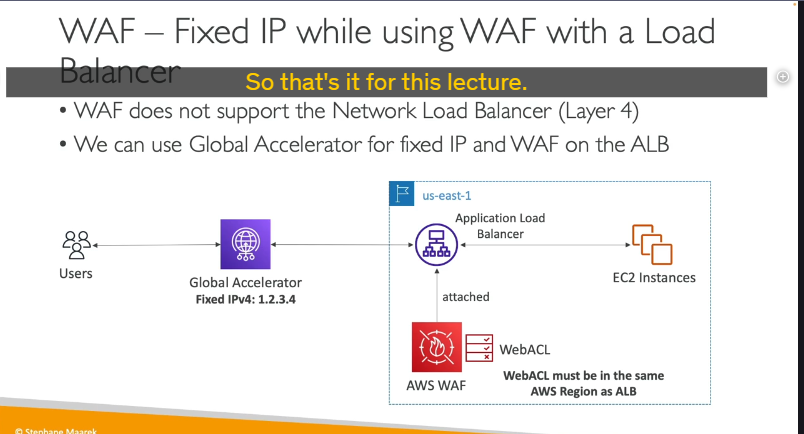

# AWS WAF - Tường Lửa Ứng Dụng Web

## Giới Thiệu

AWS WAF (Web Application Firewall) là một dịch vụ bảo vệ ứng dụng web của bạn khỏi các tấn công phổ biến ở tầng 7 (Layer 7). Cần nhớ rằng tầng 7 là tầng HTTP, nên WAF bảo vệ bạn chống lại các tấn công HTTP. Để so sánh, tầng 4 là dành cho các giao thức TCP hoặc UDP.

## Nơi Triển Khai WAF

WAF có thể được triển khai trên các dịch vụ sau:

- Application Load Balancer (ALB)
- API Gateway
- CloudFront
- AppSync GraphQL API
- Cognito User Pools

> **Lưu ý quan trọng**: Nhớ kỹ các dịch vụ có thể triển khai WAF vì đề thi có thể cố tình đánh lừa bạn. Ví dụ, đề thi có thể gợi ý triển khai WAF trên Network Load Balancer (NLB), nhưng điều này không khả thi vì NLB hoạt động ở tầng 4.

## Web ACL và Các Quy Tắc

Sau khi triển khai tường lửa trên các dịch vụ, bạn có thể định nghĩa Web ACL (Access Control Lists) và các quy tắc của chúng:

### Các Loại Quy Tắc Lọc:

1. **Địa chỉ IP**:

   - Định nghĩa IP sets với tối đa 10.000 địa chỉ IP mỗi set
   - Nếu cần thêm, bạn có thể sử dụng nhiều quy tắc

2. **Tiêu đề HTTP, phần thân (body)**:

   - Lọc dựa trên nội dung của request

3. **Chuỗi URI**:

   - Bảo vệ khỏi các tấn công phổ biến như [SQL Injection và Cross-Site Scripting (XSS)](./security-concepts/web-attacks.md)

4. **Giới hạn kích thước**:

   - Đảm bảo các request chỉ đến một giới hạn nhất định (ví dụ: 2MB)

5. **Geo-match**:

   - Cho phép hoặc chặn các quốc gia cụ thể

6. **Rate-based rules**:

   - Đếm số lượng request mỗi IP để bảo vệ DDoS
   - Ví dụ: ngăn một IP cụ thể gửi hơn 10 request mỗi giây

### Phạm Vi Web ACL

- **Regional**: Hầu hết các Web ACL đều là regional
- **Global**: Chỉ với CloudFront, các Web ACL được định nghĩa ở cấp độ toàn cầu

### Rule Groups

Rule Groups là một tập hợp các quy tắc hợp lý mà bạn có thể thêm vào nhiều Web ACL, giúp tổ chức các quy tắc một cách hiệu quả.

## Trường Hợp Sử Dụng Thực Tế

### Vấn Đề:

Làm thế nào để có một địa chỉ IP cố định cho ứng dụng trong khi sử dụng WAF với Application Load Balancer?

### Giải Pháp:

1. WAF không hỗ trợ Network Load Balancer vì NLB hoạt động ở tầng 4, trong khi WAF là cho tầng 7
2. Để cung cấp WAF, bạn cần sử dụng Application Load Balancer
3. Tuy nhiên, ALB không có IP cố định
4. Giải pháp: Sử dụng Global Accelerator để có IP cố định cho ứng dụng và bật WAF trên ALB

### Kiến Trúc:

- Một region với ALB và các EC2 instances
- Đặt Global Accelerator phía trước ALB để có IP cố định
- Gắn Web Application Firewall với WebACL vào cùng region với ALB
- Kết quả: Chúng ta đạt được kiến trúc mục tiêu với IP cố định và khả năng bảo vệ của WAF

## Tóm Tắt

- AWS WAF là tường lửa ứng dụng web bảo vệ ở tầng 7 (HTTP)
- Có thể triển khai trên ALB, API Gateway, CloudFront, AppSync GraphQL API, Cognito User Pools
- Sử dụng Web ACL với nhiều loại quy tắc lọc khác nhau
- Kết hợp với Global Accelerator để có IP cố định khi sử dụng với ALB
- Không thể triển khai trên Network Load Balancer (NLB)
