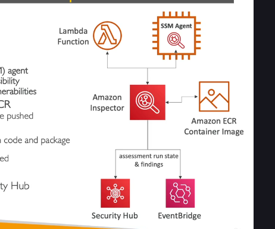

# Amazon Inspector - Dịch Vụ Đánh Giá Bảo Mật Tự Động

## Giới Thiệu

Amazon Inspector là dịch vụ đánh giá bảo mật tự động từ AWS, giúp xác định các lỗ hổng bảo mật và sai lệch so với các thực hành tốt nhất về bảo mật. Dịch vụ này giúp cải thiện tính bảo mật và tuân thủ của các ứng dụng được triển khai trên AWS.

## Các Thành Phần Được Amazon Inspector Đánh Giá

Amazon Inspector thực hiện đánh giá bảo mật trên ba loại tài nguyên chính:

### 1. EC2 Instances (Máy Chủ Ảo)

- **Cách thức hoạt động**: Sử dụng agent Systems Manager trên các EC2 instances
- **Đánh giá**:
  - Khả năng truy cập mạng không mong muốn
  - Phân tích hệ điều hành đang chạy để tìm lỗ hổng đã biết
- **Tần suất**: Liên tục, tự động

### 2. Container Images trên Amazon ECR

- **Đối tượng**: Các image container (như Docker) được đẩy lên Amazon ECR
- **Đánh giá**: Phân tích các lỗ hổng đã biết trong các image
- **Thời điểm**: Thực hiện khi image được đẩy lên ECR

### 3. Lambda Functions (Hàm Lambda)

- **Đánh giá**: Phân tích lỗ hổng phần mềm trong mã hàm và các gói phụ thuộc
- **Thời điểm**: Thực hiện khi hàm được triển khai

## Quy Trình Đánh Giá Bảo Mật

Amazon Inspector thực hiện đánh giá bảo mật theo quy trình sau:

1. **Quét liên tục**: Tự động quét các tài nguyên khi cần thiết
2. **Cơ sở dữ liệu lỗ hổng**: Sử dụng cơ sở dữ liệu [CVE(Common Vulnerabilities and Exposures)](./security-concepts/vulnerability-scoring.md) để kiểm tra:
   - Lỗ hổng gói phần mềm trên EC2, ECR và Lambda
   - Khả năng truy cập mạng trên EC2
3. **Cập nhật quét**: Tự động quét lại khi cơ sở dữ liệu CVE được cập nhật
4. **Điểm rủi ro**: Gán điểm rủi ro cho mỗi lỗ hổng để xác định mức độ ưu tiên xử lý

## Tích Hợp Với Các Dịch Vụ AWS Khác

Sau khi hoàn thành đánh giá, Amazon Inspector:

- Báo cáo phát hiện đến AWS Security Hub
- Gửi phát hiện và sự kiện đến Amazon EventBridge
- Cho phép tập trung theo dõi các lỗ hổng trên cơ sở hạ tầng
- Hỗ trợ tự động hóa phản hồi thông qua EventBridge

## Lợi Ích Của Amazon Inspector

- **Tự động hóa**: Không cần can thiệp thủ công để thực hiện đánh giá bảo mật
- **Cập nhật liên tục**: Luôn cập nhật với các lỗ hổng mới được phát hiện
- **Ưu tiên dựa trên rủi ro**: Giúp tập trung vào các lỗ hổng quan trọng nhất trước
- **Tích hợp liền mạch**: Hoạt động với nhiều dịch vụ AWS khác

## Tóm Tắt

Amazon Inspector là dịch vụ đánh giá bảo mật tự động, hỗ trợ quét liên tục EC2 instances, container images trên ECR và hàm Lambda để phát hiện lỗ hổng bảo mật. Dịch vụ này giúp cải thiện bảo mật ứng dụng trên AWS bằng cách xác định vấn đề và cung cấp hướng dẫn khắc phục.

[Tìm hiểu thêm về các khái niệm lỗ hổng CVE và hệ thống điểm CVSS](./security-concepts/vulnerability-scoring.md)
