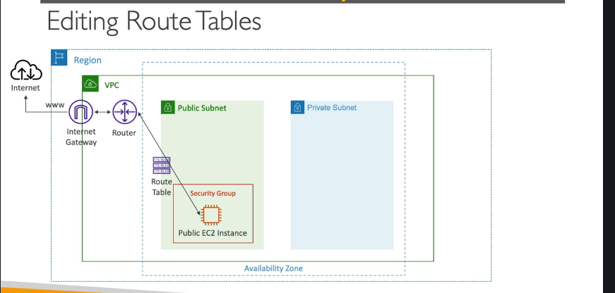

# **Vấn đề ban đầu:**

- Khi bạn mới tạo các Subnet trong VPC tùy chỉnh của mình, theo mặc định, chúng **chưa có kết nối Internet**.
- Sự khác biệt giữa một "Public Subnet" (Subnet công khai) và một "Private Subnet" (Subnet riêng tư) chính là ở việc Subnet đó có được cấu hình để có lối ra Internet trực tiếp hay không. Hiện tại, các Subnet mới tạo đều chưa có kết nối này.

# **Internet Gateway (IGW) là gì?**

- Internet Gateway là một **thành phần mạng** của VPC.
- Chức năng của nó là cho phép các tài nguyên bên trong VPC (như phiên bản EC2, hàm Lambda trong VPC, v.v.) có thể **kết nối với Internet**.

**Đặc điểm của Internet Gateway:**

- **Có khả năng mở rộng theo chiều ngang (Scales horizontally):** Tự động mở rộng để xử lý lượng truy cập Internet lớn.
- **Tính sẵn sàng cao và dư thừa(chịu lỗi cao) (Highly available and redundant):** Được AWS quản lý để luôn sẵn sàng và chống lỗi.
- Là một tài nguyên được AWS **quản lý hoàn toàn** (managed resource).
- Phải được **tạo ra riêng biệt** (separately) và sau đó được **đính kèm (attach)** vào một VPC.

**Quan hệ giữa Internet Gateway và VPC:**

- **Một VPC chỉ có thể đính kèm với DUY NHẤT một Internet Gateway** và ngược lại (một Internet Gateway chỉ có thể đính kèm với DUY NHẤT một VPC tại một thời điểm).

**Điểm Quan trọng Cốt lõi:**

- Việc **chỉ tạo và đính kèm** một Internet Gateway vào VPC **KHÔNG ĐỦ** để cung cấp kết nối Internet cho các Subnet.
- Internet Gateway chỉ là **cửa ngõ tiềm năng**. Để lưu lượng mạng thực sự đi qua cánh cửa này ra Internet, bạn **bắt buộc phải chỉnh sửa Bảng Định tuyến (Route Table)** của Subnet để chỉ định đường đi đó.

**Làm thế nào để có Internet Access (Sơ đồ luồng logic):**

Để một phiên bản EC2 trong Subnet có thể kết nối ra Internet, cần có các thành phần và cấu hình sau:

1. **Tạo và đính kèm Internet Gateway** vào VPC.
2. **Chỉnh sửa Bảng Định tuyến (Route Table)** được liên kết với Subnet đó.
   - Thêm một quy tắc định tuyến mới (a new route) trong Bảng định tuyến.
   - Quy tắc này sẽ chỉ định rằng **tất cả lưu lượng mạng muốn đi ra Internet** (thường được biểu diễn bằng khối CIDR `0.0.0.0/0`) sẽ được gửi đến **Internet Gateway** đã đính kèm vào VPC.
3. **Lưu lượng từ phiên bản EC2 sẽ đi theo luồng logic sau:**
   - Yêu cầu từ Phiên bản EC2 -> được xử lý bởi **VPC Router** (nằm trong Subnet).
   - Router kiểm tra Bảng Định tuyến của Subnet.
   - Nếu đích đến là Internet, Router sẽ đẩy lưu lượng theo quy tắc `0.0.0.0/0` -> đến **Internet Gateway**.
   - Internet Gateway chuyển lưu lượng ra **Internet**.

**Tóm lại:**

Internet Gateway là cánh cổng ra Internet cho VPC. Tuy nhiên, để cánh cổng này hoạt động cho một Subnet cụ thể, bạn phải cấu hình Bảng định tuyến của Subnet đó để chỉ dẫn lưu lượng mạng đi ra Internet thông qua Internet Gateway. Bước tiếp theo sẽ là thực hành tạo IGW và chỉnh sửa Bảng định tuyến để biến một Subnet thành "Public Subnet".

---

# các bước cấu hình để cung cấp truy cập Internet cho các Subnet trong VPC tùy chỉnh của bạn, làm rõ sự khác biệt giữa Public và Private Subnet.

**Mục tiêu:** Cho phép các phiên bản EC2 trong một Subnet cụ thể (Public Subnet) có thể kết nối ra Internet.

**Trạng thái ban đầu:** Chúng ta đã có một VPC tùy chỉnh (`DemoVPC`) với các Subnet được tạo ra (ví dụ: `PublicSubnetA`, `PrivateSubnetB`, v.v.) nhưng hiện tại chúng chưa có kết nối Internet.

**Bước 1: Khởi chạy phiên bản EC2 vào Subnet để kiểm tra (và cấu hình Auto-Assign Public IP)**

- **Kiểm tra ban đầu:** Trước tiên, khởi chạy một phiên bản EC2 vào một trong các Subnet vừa tạo (ví dụ: `PublicSubnetA`) để xác nhận rằng nó chưa có Internet.
- **Quan sát cài đặt IP công khai:** Khi cấu hình khởi chạy phiên bản, trong phần Network Settings, chọn `DemoVPC` và `PublicSubnetA`. Bạn sẽ thấy tùy chọn "Auto-assign Public IP" (Tự động gán IP công khai) mặc định là **Disabled** (Tắt) cho Subnet này (khác với Default VPC mặc định là Enabled).
- **Cấu hình Subnet để tự động gán IP công khai:**
  - Để một Subnet trở thành Public Subnet đúng nghĩa và các phiên bản khởi chạy vào đó tự động nhận IP công khai, bạn cần bật cài đặt này ở cấp độ **Subnet**.
  - Vào VPC console -> Subnets -> chọn `PublicSubnetA` -> Actions -> Edit subnet settings -> Tích chọn "Enable auto-assign public IPv4 address" -> Save.
  - Lặp lại cho `PublicSubnetB`.
  - Sau khi bật cài đặt này, khi bạn quay lại màn hình cấu hình khởi chạy EC2 và chọn `PublicSubnetA`, tùy chọn "Auto-assign Public IP" sẽ mặc định là **Enabled**.
- **Khởi chạy phiên bản EC2 (có IP công khai):** Tiếp tục cấu hình khởi chạy phiên bản EC2 (chọn AMI Linux 2, t2.micro, không cần Key Pair cho mục đích kiểm tra này) vào `PublicSubnetA` (đã bật Auto-assign Public IP). Tạo Security Group mới cho phép SSH (Port 22) từ địa chỉ IP của bạn (hoặc từ mọi nơi `0.0.0.0/0` để đơn giản hóa cho demo, mặc dù không khuyến khích trong thực tế). Khởi chạy phiên bản.
- **Kiểm tra kết nối (lần 1):** Sau khi phiên bản chạy, nó sẽ có địa chỉ IP công khai. Thử kết nối đến nó (ví dụ: dùng EC2 Instance Connect). Bạn sẽ thấy **không kết nối được**. Điều này cho thấy chỉ có IP công khai là chưa đủ, cần cấu hình mạng thêm.

**Bước 2: Tạo và Đính kèm Internet Gateway (IGW)**

- **Tạo IGW:** Vào VPC console -> Internet Gateways -> Create Internet Gateway. Đặt tên (ví dụ: `DemoIGW`). Nhấp Create.
- **Đính kèm IGW vào VPC:** Sau khi tạo, IGW sẽ ở trạng thái `Detached`. Chọn IGW vừa tạo -> Actions -> Attach to VPC. Chọn `DemoVPC` của bạn -> Attach.
- **Kiểm tra kết nối (lần 2):** Thử kết nối lại đến phiên bản EC2. Vẫn **không kết nối được**. Điều này chứng minh: Chỉ tạo và đính kèm IGW vào VPC là **chưa đủ** để có Internet Access. Cần thêm cấu hình định tuyến.

**Bước 3: Cấu hình Bảng Định tuyến (Route Table)**

- **Vai trò của Route Table:** Route Table chứa các quy tắc (routes) chỉ cho VPC biết cách định tuyến lưu lượng mạng đi đâu.
- **Bảng định tuyến mặc định (Main Route Table):** Mỗi VPC có một bảng định tuyến chính mặc định. Các Subnet mới tạo ban đầu sẽ **liên kết ngầm (implicitly associated)** với bảng định tuyến chính nếu bạn không gán rõ ràng chúng cho một bảng định tuyến khác.
- **Thực hành tốt hơn: Liên kết rõ ràng (Explicit Association):** Để quản lý dễ dàng và tránh nhầm lẫn, thực hành tốt hơn là **tạo các bảng định tuyến riêng** cho Public Subnet và Private Subnet, sau đó **gán rõ ràng (explicitly associate)** các Subnet tương ứng vào các bảng định tuyến đó.
- **Tạo Bảng Định tuyến riêng:**

  - Vào VPC console -> Route Tables -> Create route table.
  - Tạo `PublicRouteTable` và gán cho `DemoVPC`.
  - Tạo `PrivateRouteTable` và gán cho `DemoVPC`.

- **Gán Subnet rõ ràng vào Bảng Định tuyến:**

  - Chọn `PublicRouteTable` -> tab "Subnet associations" -> Edit subnet associations -> Chọn `PublicSubnetA` và `PublicSubnetB` -> Save.
  - Chọn `PrivateRouteTable` -> tab "Subnet associations" -> Edit subnet associations -> Chọn `PrivateSubnetA` và `PrivateSubnetB` -> Save.
  - **Lưu ý:** Sau khi gán rõ ràng tất cả các Subnet, bảng định tuyến chính (Main Route Table) sẽ không còn Subnet nào liên kết ngầm nữa.

**Bước 4: Thêm Quy tắc Định tuyến ra Internet vào Bảng Định tuyến Công khai (Public Route Table)**

- **Mục tiêu:** Chỉ dẫn cho các Subnet liên kết với `PublicRouteTable` biết đường ra Internet thông qua IGW.
- **Chỉnh sửa `PublicRouteTable`:** Chọn `PublicRouteTable` -> tab "Routes" -> Edit routes.
- **Xem quy tắc mặc định:** Bạn sẽ thấy quy tắc `[CIDR của VPC]` -> `local` (cho phép giao tiếp nội bộ VPC).
- **Thêm quy tắc ra Internet:**
  - Nhấp "Add route".
  - **Destination:** Nhập `0.0.0.0/0` (biểu thị "mọi địa chỉ IP bên ngoài VPC").
  - **Target:** Chọn "Internet Gateway" và chọn `DemoIGW` bạn đã tạo.
  - Nhấp "Save changes".

**Bước 5: Kiểm tra lại Kết nối Internet**

- Quay lại EC2 console -> chọn phiên bản EC2 đã khởi chạy vào `PublicSubnetA` (phiên bản này liên kết với `PublicRouteTable`).
- Nhấp EC2 Instance Connect -> Connect.
- **Kết nối thành công!** Bạn đã có thể truy cập vào phiên bản EC2.
- Bên trong phiên bản, thử kiểm tra kết nối Internet (ví dụ: `ping google.com`).
- **Ping thành công!** Phiên bản EC2 đã có kết nối Internet.

**Kết luận về Public Subnet:**

Một **Public Subnet** là một Subnet được liên kết (thường là liên kết rõ ràng) với một Bảng Định tuyến (Route Table) có một **quy tắc định tuyến cho `0.0.0.0/0` trỏ đến một Internet Gateway**. Các phiên bản trong Public Subnet thường được cấu hình để tự động gán IP công khai để có thể nhận lưu lượng từ Internet (nếu Security Group và NACL cho phép).

**Private Subnet:**

- Một **Private Subnet** là một Subnet được liên kết với một Bảng Định tuyến **KHÔNG có** quy tắc định tuyến `0.0.0.0/0` trỏ trực tiếp đến Internet Gateway.
- Các phiên bản trong Private Subnet không có đường ra Internet trực tiếp thông qua IGW. Nếu chúng cần truy cập Internet (ví dụ để tải bản cập nhật) mà không nhận lưu lượng từ ngoài vào, chúng sẽ cần một giải pháp khác như NAT Gateway hoặc NAT Instance (sẽ học sau).

Quá trình này đã minh họa rõ cách các thành phần VPC (Subnet, Internet Gateway, Route Table) làm việc cùng nhau để điều khiển truy cập Internet.
