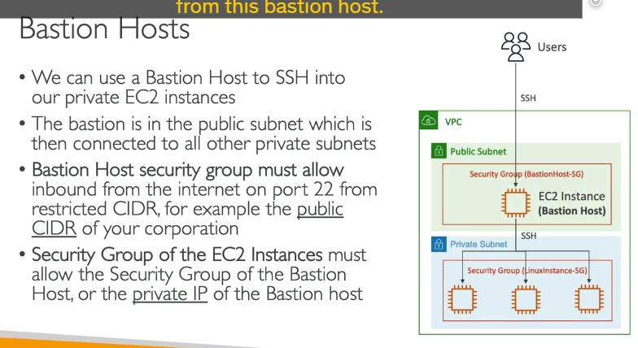

# **Vấn đề:**

- Bạn là người dùng đang làm việc trên máy tính của mình kết nối với **Internet công cộng**.
- Bạn cần truy cập (ví dụ: qua SSH) vào một phiên bản Amazon EC2 nằm trong **Subnet riêng tư (Private Subnet)** của VPC.
- Bởi vì phiên bản EC2 này nằm trong Private Subnet, nó **không có địa chỉ IP công khai** và **không có kết nối trực tiếp từ Internet công cộng**. Do đó, bạn không thể SSH trực tiếp từ máy tính của mình trên Internet vào nó.

# **Giải pháp: Sử dụng Bastion Host (Máy chủ trung gian)**

- **Bastion Host** là một phiên bản EC2 được cấu hình và sử dụng làm **điểm truy cập an toàn và duy nhất** để vào các tài nguyên bên trong mạng riêng (như các phiên bản EC2 trong Private Subnet).
- Bastion Host bản thân nó là một phiên bản EC2 bình thường, nhưng được đặt ở một vị trí đặc biệt trong mạng VPC của bạn.

## **Vị trí của Bastion Host:**

- Bastion Host **phải được đặt trong một Public Subnet** (Subnet công khai).
- Việc đặt trong Public Subnet cho phép Bastion Host có địa chỉ IP công khai và có thể truy cập được từ Internet công cộng.

## **Cách thức hoạt động:**

1. Bạn (người dùng trên Internet công cộng) **kết nối (ví dụ: SSH)** đến **địa chỉ IP công khai của Bastion Host**.
2. Từ Bastion Host (bây giờ bạn đã ở bên trong mạng VPC, hoặc ít nhất là trong một phần có thể truy cập các Subnet khác trong VPC), bạn **kết nối tiếp (ví dụ: SSH)** từ Bastion Host đến **địa chỉ IP riêng tư (Private IP) của phiên bản EC2 đích** trong Private Subnet.
3. Từ đó, bạn có thể quản lý hoặc tương tác với phiên bản EC2 trong Private Subnet. Mô hình này có thể áp dụng cho một hoặc nhiều phiên bản EC2 trong Private Subnet.

**Vai trò:** Bastion Host đóng vai trò là một "điểm nhảy" hoặc "cửa ngõ" duy nhất, có kiểm soát để truy cập vào các tài nguyên nội bộ không thể truy cập trực tiếp từ Internet.

**Các Quy tắc Security Group (Quan trọng cho bài thi):**

Việc cấu hình Security Group là cực kỳ quan trọng để đảm bảo tính bảo mật của giải pháp Bastion Host:

1. **Security Group của Bastion Host:**

   - Cần cho phép lưu lượng **truy cập vào (inbound)** từ Internet (ví dụ: SSH trên cổng 22).
   - **QUAN TRỌNG về bảo mật:** Thay vì cho phép truy cập từ **mọi nơi** trên Internet (`0.0.0.0/0`), bạn nên **hạn chế nguồn (source) truy cập** này càng nhiều càng tốt. Ví dụ: Chỉ cho phép truy cập từ dải địa chỉ IP công cộng của mạng công ty bạn, hoặc các địa chỉ IP tĩnh mà người dùng của bạn sử dụng. Điều này giúp giảm thiểu bề mặt tấn công.
   - Lý do hạn chế: Nếu một kẻ tấn công ngẫu nhiên nào đó truy cập được vào Bastion Host, họ có thể lợi dụng nó để tấn công sâu hơn vào hạ tầng của bạn. Hạn chế nguồn truy cập làm giảm rủi ro này.

2. **Security Group của Phiên bản EC2 trong Private Subnet:**

   - Cần cho phép lưu lượng **truy cập vào (inbound)** (ví dụ: SSH trên cổng 22) đến phiên bản này.
   - **ĐIỂM CỐT LÕI:** Nguồn truy cập được cho phép **KHÔNG phải là Internet công cộng**. Nguồn truy cập được cho phép phải là:
     - **Địa chỉ IP riêng tư (Private IP)** của Bastion Host.
     - **HOẶC (Tốt hơn) ID của Security Group** của Bastion Host.
   - **Giải thích:** Bởi vì lưu lượng SSH từ người dùng sẽ đi từ máy tính của họ -> đến Bastion Host -> từ Bastion Host đến phiên bản Private EC2. Từ góc độ của phiên bản Private EC2, lưu lượng SSH này **bắt nguồn từ Bastion Host** (hoặc Security Group của nó). Do đó, cấu hình Security Group Private EC2 cho phép truy cập từ IP/Security Group của Bastion Host sẽ chỉ cho phép các kết nối đến từ Bastion Host mà thôi.

**Tóm lại:** Bastion Host là một giải pháp hiệu quả để truy cập các phiên bản EC2 trong Private Subnet từ Internet công cộng một cách có kiểm soát. Việc đặt Bastion Host trong Public Subnet và cấu hình Security Group chặt chẽ (đặc biệt là hạn chế nguồn truy cập vào Bastion Host và chỉ cho phép Bastion Host truy cập vào các phiên bản Private) là các yếu tố then chốt cho tính bảo mật của mô hình này.
