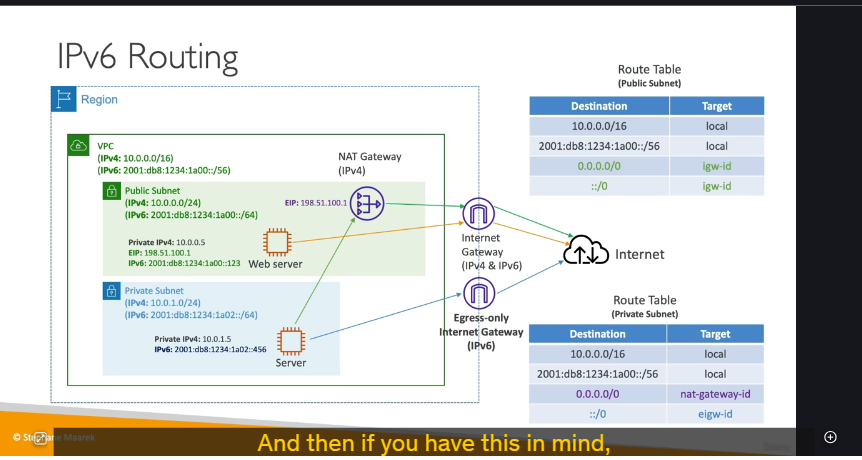

### Egress-Only Internet Gateway là gì?

**Egress-Only Internet Gateway** là một gateway được thiết kế **chỉ dành riêng cho traffic IPv6**. Chức năng của nó tương tự như một **NAT Gateway** đối với IPv4.

Mục đích chính của nó là cho phép các instance trong một subnet riêng tư (private subnet) có thể **khởi tạo kết nối đi ra (outbound)** Internet qua giao thức IPv6, nhưng đồng thời **ngăn chặn** mọi kết nối từ Internet **khởi tạo đi vào (inbound)** các instance đó.

---

### So sánh kiến trúc Public và Private Subnet với IPv6

Để hiểu rõ vai trò của Egress-Only Internet Gateway, hãy so sánh cấu hình route table của một public subnet và một private subnet trong môi trường dual-stack (có cả IPv4 và IPv6).

#### **1. Public Subnet 🌐**

Một instance trong public subnet cần có khả năng truy cập Internet và được truy cập từ Internet.

- **Kiến trúc:** Instance kết nối trực tiếp với **Internet Gateway** cho cả traffic IPv4 và IPv6.
- **Route Table:**
  - `10.0.0.0/16` (IPv4 VPC) → `local`
  - `fd12:.../56` (IPv6 VPC) → `local`
  - `0.0.0.0/0` (tất cả IPv4) → **`internet-gateway-id`**
  - `::/0` (tất cả IPv6) → **`internet-gateway-id`**

#### **2. Private Subnet 🔒**

Một instance trong private subnet chỉ cần truy cập ra Internet để cập nhật phần mềm, gọi API... nhưng không được phép bị truy cập trực tiếp từ Internet.

- **Kiến trúc:**
  - Đối với **IPv4**: Instance kết nối đến **NAT Gateway**.
  - Đối với **IPv6**: Instance kết nối đến **Egress-Only Internet Gateway**.
- **Route Table:**
  - `10.0.0.0/16` (IPv4 VPC) → `local`
  - `fd12:.../56` (IPv6 VPC) → `local`
  - `0.0.0.0/0` (tất cả IPv4) → **`nat-gateway-id`**
  - `::/0` (tất cả IPv6) → **`egress-only-internet-gateway-id`**

### Tổng kết

Việc hiểu rõ sự khác biệt giữa ba loại gateway này là cực kỳ quan trọng:

- **Internet Gateway:** Cho phép giao tiếp hai chiều (inbound và outbound) cho cả IPv4 và IPv6. Dùng cho public subnet.
- **NAT Gateway:** Chỉ cho phép traffic **IPv4** đi ra (outbound) từ private subnet.
- **Egress-Only Internet Gateway:** Chỉ cho phép traffic **IPv6** đi ra (outbound) từ private subnet.
