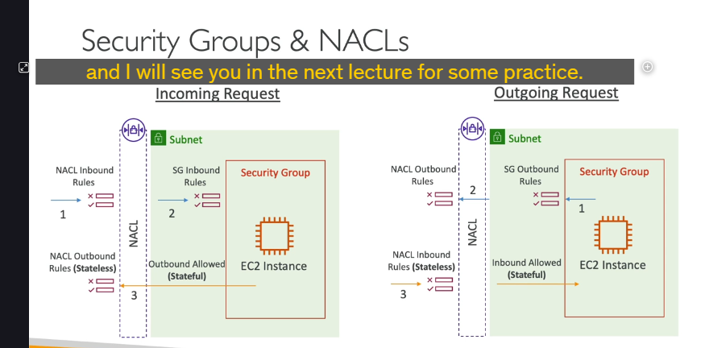
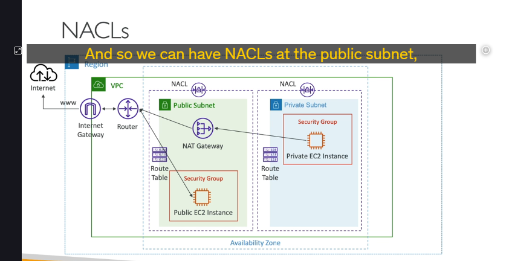
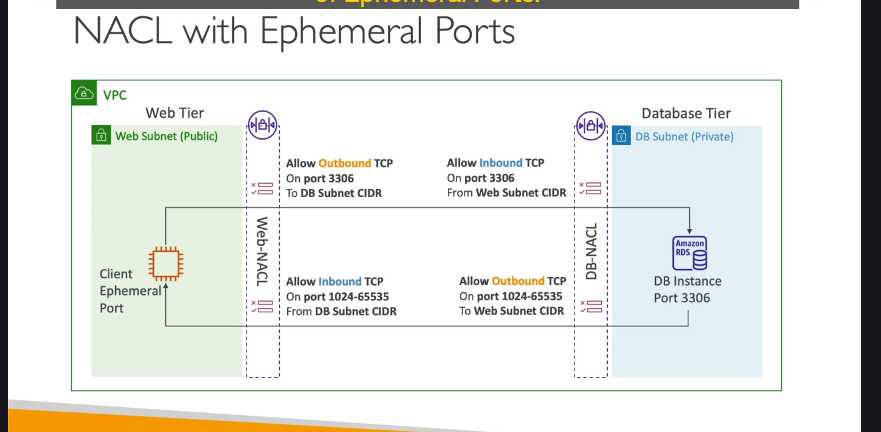

**Giới thiệu:**

- **Security Group (SG):** Hoạt động ở cấp độ **phiên bản (instance level)**. Bạn đính kèm Security Group vào từng phiên bản EC2.
- **Network ACL (NACL):** Hoạt động ở cấp độ **subnet (subnet level)**. Nó là một lớp tường lửa bảo vệ cho toàn bộ subnet.

**Luồng Yêu cầu Mạng và Vai trò của NACL vs SG (Điểm Cốt lõi: Stateful vs Stateless)**

Để hiểu rõ vai trò và sự khác biệt, hãy xem một yêu cầu mạng đi qua các lớp này:

**1. Yêu cầu TỪ BÊN NGOÀI đi VÀO phiên bản EC2 trong Subnet:**

- Yêu cầu mạng đi đến **NACL Inbound Rules (Luật chiều vào của NACL)** của Subnet chứa phiên bản EC2.
- **NACL đánh giá luật:** NACL kiểm tra xem có luật nào cho phép hoặc từ chối yêu cầu này dựa trên IP nguồn, cổng đích, giao thức, v.v.
- **NACL là Stateless (Không trạng thái):** Đây là điểm RẤT QUAN TRỌNG. NACL xử lý các yêu cầu vào và ra hoàn toàn độc lập. Nếu yêu cầu vào được cho phép, **phản hồi trả lời từ phiên bản đi ra sẽ KHÔNG TỰ ĐỘNG được cho phép**. NACL Outbound Rules sẽ phải cho phép nó đi ra.
- Nếu NACL Inbound cho phép, yêu cầu đi vào trong Subnet và đến **Security Group Inbound Rules (Luật chiều vào của Security Group)** đính kèm với phiên bản EC2.
- **Security Group đánh giá luật:** SG kiểm tra xem có luật nào cho phép yêu cầu này không.
- **Security Group là Stateful (Có trạng thái):** Đây cũng là điểm RẤT QUAN TRỌNG. Nếu Security Group Inbound cho phép một yêu cầu đi vào, thì **phản hồi trả lời tương ứng từ phiên bản đi ra sẽ TỰ ĐỘNG được cho phép**, bất kể Security Group Outbound Rules là gì. SG theo dõi trạng thái kết nối.
- Nếu Security Group Inbound cho phép, yêu cầu đến phiên bản EC2.
- Phiên bản EC2 xử lý và gửi phản hồi trả lời.
- Phản hồi trả lời này đi ra và đến **Security Group Outbound Rules (Luật chiều ra của Security Group)**. Do SG là Stateful, phản hồi này được **TỰ ĐỘNG cho phép đi ra** (luật Outbound của SG không được đánh giá cho lưu lượng trả lời của kết nối đã được SG Inbound cho phép).
- Phản hồi đi ra và đến **NACL Outbound Rules (Luật chiều ra của NACL)** của Subnet.
- **NACL là Stateless:** NACL đánh giá luật chiều ra. Phản hồi chỉ được đi ra nếu có luật **NACL Outbound cho phép**. (Nhớ lại: NACL Inbound đã cho phép vào không đảm bảo NACL Outbound cho phép ra).

**2. Yêu cầu TỪ PHIÊN BẢN EC2 đi RA ngoài Internet/đến đích khác:**

- Phiên bản EC2 tạo một yêu cầu đi ra ngoài (ví dụ: ping google.com).
- Yêu cầu đi đến **Security Group Outbound Rules (Luật chiều ra của Security Group)**.
- **Security Group đánh giá luật:** SG kiểm tra xem có luật nào cho phép yêu cầu này đi ra không.
- Nếu SG Outbound cho phép, yêu cầu đi đến **NACL Outbound Rules (Luật chiều ra của NACL)** của Subnet.
- **NACL đánh giá luật:** NACL kiểm tra xem có luật nào cho phép yêu cầu này đi ra không.
- Nếu NACL Outbound cho phép, yêu cầu rời khỏi Subnet và đi đến đích.
- Đích xử lý và gửi phản hồi trả lời về.
- Phản hồi trả lời đi về và đến **NACL Inbound Rules (Luật chiều vào của NACL)** của Subnet.
- **NACL đánh giá luật:** NACL kiểm tra xem có luật nào cho phép phản hồi này đi vào không. Phản hồi chỉ được đi vào nếu có luật **NACL Inbound cho phép**. (Nhớ lại: NACL Outbound đã cho phép ra không đảm bảo NACL Inbound cho phép vào).
- Nếu NACL Inbound cho phép, phản hồi đi vào trong Subnet và đến **Security Group Inbound Rules (Luật chiều vào của Security Group)** đính kèm với phiên bản EC2. Do SG là Stateful và yêu cầu gốc (chiều ra) đã được SG Outbound cho phép, phản hồi trả lời này được **TỰ ĐỘNG cho phép đi vào** (luật Inbound của SG không được đánh giá cho lưu lượng trả lời của kết nối đã được SG Outbound cho phép).

**Tóm lại về Stateful vs Stateless:**

- **Security Group (Stateful):** Chỉ cần cho phép một chiều (vào hoặc ra), chiều ngược lại của cùng kết nối đó sẽ tự động được cho phép. Security Group là stateful. Nếu instance chủ động gửi request ra ngoài (outbound traffic), thì traffic trả về (inbound traffic) liên quan đến request đó sẽ tự động được cho phép, bất kể inbound rule của Security Group có được cấu hình hay không. Inbound rule của Security Group chỉ ảnh hưởng đến việc traffic từ bên ngoài khởi tạo kết nối vào instance .
- **NACL (Stateless):** Mỗi chiều (vào và ra) được đánh giá độc lập. Phải có luật cho phép cả hai chiều (vào VÀ ra) cho một kết nối hoạt động đầy đủ.

**Chi tiết về Network Access Control Lists (NACLs):**

- Hoạt động như một tường lửa cho phép/từ chối lưu lượng ở ranh giới **Subnet**.
- **Mỗi Subnet** phải liên kết với một NACL.
- Mỗi Subnet mới tạo (trong VPC tùy chỉnh) ban đầu sẽ được gán **Default NACL** của VPC đó.
- **Luật (Rules):** Có số thứ tự từ 1 đến 32766.
  - Số thứ tự **NHỎ HƠN** có **độ ưu tiên CAO HƠN**. (Luật số 1 có ưu tiên cao nhất).
  - NACL đánh giá luật theo thứ tự từ nhỏ đến lớn.
  - **Luật KHỚP ĐẦU TIÊN** sẽ quyết định (First rule match wins). Các luật sau đó có số thứ tự lớn hơn sẽ bị bỏ qua cho gói tin đó.
  - Luật cuối cùng (số thứ tự lớn nhất, thường là `*`) là luật **từ chối (DENY)** tất cả các lưu lượng không khớp với bất kỳ luật nào trước đó.
- **Khuyến nghị:** AWS khuyến nghị đặt số thứ tự luật theo bội số của 100 (100, 200, 300, ...) để dễ dàng chèn thêm luật mới vào giữa sau này (ví dụ: chèn luật 150 giữa 100 và 200).
- **NACL mới tạo (Custom NACL):** Mặc định sẽ **từ chối TẤT CẢ** lưu lượng (chỉ có luật `* DENY`).
- **Trường hợp sử dụng chính:** NACL rất tốt để **chặn một địa chỉ IP cụ thể** ở cấp độ Subnet (vì hỗ trợ luật DENY).

**Default NACL (NACL Mặc định):**

- Rất quan trọng cho bài thi.
- Đặc điểm **độc đáo:** Không giống Custom NACL, Default NACL mặc định **cho phép TẤT CẢ** lưu lượng (chiều vào VÀ chiều ra) cho các Subnet liên kết với nó.
- Cấu hình mặc định của Default NACL cho IPv4 là:
  - Inbound Rules: Rule 100 Allow All Traffic from 0.0.0.0/0
  - Outbound Rules: Rule 100 Allow All Traffic to 0.0.0.0/0
  - (Luật `* DENY` cuối cùng vẫn tồn tại nhưng sẽ không bao giờ khớp vì Rule 100 đã cho phép hết).
- Mục đích Default NACL mở là để người dùng mới dễ dàng bắt đầu mà không bị chặn kết nối.
- **Khuyến nghị:** Không nên sửa đổi Default NACL. Nếu cần cấu hình bảo mật tùy chỉnh cho Subnet, hãy tạo một Custom NACL mới (nó sẽ mặc định từ chối hết) và liên kết Subnet vào đó.
- **Điểm nhớ cho bài thi:** Nếu một Subnet liên kết với Default NACL, mặc định nó sẽ cho phép TẤT CẢ lưu lượng vào và ra.

**Ephemeral Ports (Cổng Tạm thời):**

- Khi một **client** kết nối đến một **server** trên một cổng xác định (ví dụ: cổng 80 cho HTTP), client sẽ **tự mở một cổng ngẫu nhiên** trên chính nó để nhận phản hồi từ server.
- Cổng ngẫu nhiên này là **Cổng Tạm thời (Ephemeral Port)**, chỉ tồn tại trong suốt thời gian kết nối.
- Dải cổng tạm thời khác nhau tùy thuộc vào hệ điều hành của client (ví dụ: Windows 10: 49152-65535, Linux: 32768-60999).
- **Tầm quan trọng với NACL:** Do NACL là **Stateless**, bạn cần phải thêm các luật cho phép lưu lượng trả lời trên các **dải cổng tạm thời** này cho cả **NACL Outbound** (trên Subnet của server) và **NACL Inbound** (trên Subnet của client) để kết nối hai chiều hoạt động.

  

- ## **Ví dụ Client (Web) kết nối Database:**

  - NACL Outbound của Web Subnet: Cho phép TCP trên cổng DB (3306) đến CIDR của DB Subnet.
  - NACL Inbound của DB Subnet: Cho phép TCP trên cổng DB (3306) từ CIDR của Web Subnet.
  - NACL **Outbound** của DB Subnet: Cho phép TCP trên **Dải cổng tạm thời** đến CIDR của Web Subnet (cho phản hồi từ DB về client).
  - NACL **Inbound** của Web Subnet: Cho phép TCP trên **Dải cổng tạm thời** từ CIDR của DB Subnet (cho phản hồi từ DB vào client).

**Tóm tắt So sánh Security Group và NACL:**

| Đặc điểm          | Security Group (SG)                                                    | Network ACL (NACL)                                                                                   |
| :---------------- | :--------------------------------------------------------------------- | :--------------------------------------------------------------------------------------------------- |
| **Cấp độ**        | Phiên bản (Instance)                                                   | Subnet                                                                                               |
| **Loại luật**     | Chỉ hỗ trợ**ALLOW**.                                                   | Hỗ trợ cả **ALLOW và DENY**. (Dùng DENY để chặn IP cụ thể).                                          |
| **Trạng thái**    | **Stateful** (Có trạng thái). Lưu lượng trả lời TỰ ĐỘNG được cho phép. | **Stateless** (Không trạng thái). Lưu lượng vào và ra được đánh giá ĐỘC LẬP. (Nhớ về cổng tạm thời). |
| **Đánh giá luật** | Tất cả các luật được đánh giá để quyết định.                           | Đánh giá theo số thứ tự (từ nhỏ đến lớn). Luật KHỚP ĐẦU TIÊN sẽ quyết định.                          |
| **Áp dụng**       | Áp dụng cho các phiên bản EC2 được chỉ định.                           | Áp dụng cho TẤT CẢ các phiên bản EC2 trong Subnet liên kết.                                          |

Hiểu rõ sự khác biệt giữa Stateful/Stateless và cách NACL xử lý luật (thứ tự, Deny) là rất quan trọng cho bài thi.

---

bài lab :

1.  **Thiết lập:** Cài đặt một web server đơn giản (HTTPD) trên Bastion Host (nằm trong Public Subnet dùng bastion sẵn có của các bài lab trước thôi ). Mở cổng 80 trong Security Group của Bastion Host để truy cập HTTP từ ngoài. (Kiểm tra thấy truy cập web thành công).

2.  **Demo NACL - Thứ tự luật (Rule Order):**

    - Sửa **Default NACL** (liên kết với subnet của Bastion Host). Thêm luật **DENY** HTTP (cổng 80) với **số thứ tự nhỏ hơn** luật mặc định **ALLOW All** (ví dụ: DENY @80, ALLOW @100). -> Truy cập web **THẤT BẠI**. (Luật số nhỏ thắng).
    - Sửa lại luật DENY thành **số thứ tự lớn hơn** luật mặc định ALLOW All (ví dụ: DENY @140, ALLOW @100). -> Truy cập web **THÀNH CÔNG**. (Luật số nhỏ thắng - ALLOW @100).
    - **Kết luận:** **Thứ tự (số thứ tự luật) quan trọng trong NACL**.

3.  **Demo NACL - Statelessness:**

    - Sửa **Default NACL**. Đảm bảo luật **Inbound** cho phép HTTP (ví dụ: ALLOW All @100). Sửa luật **Outbound** thành **DENY All**.
    - Truy cập web: Yêu cầu vào được (Inbound OK), nhưng phản hồi (chiều ra) bị chặn bởi luật Outbound DENY. -> Truy cập web **THẤT BẠI** (chờ mãi không tải xong).
    - **Kết luận:** **NACL là Stateless**, cần luật cho phép cả hai chiều (vào VÀ ra) cho một kết nối hoạt động đầy đủ.

4.  **Demo Security Group - Statefulness:**
    - Đảm bảo **NACL** cho phép cả hai chiều (trở về mặc định ALLOW All).
    - Sửa **Security Group** của Bastion Host. Xóa luật **Outbound ALLOW All**.
    - Truy cập web: Yêu cầu vào được (Inbound OK). Dù không có luật Outbound, phản hồi (chiều ra) vẫn đi được vì SG là Stateful. -> Truy cập web **THÀNH CÔNG**.
    - **Kết luận:** **Security Group là Stateful**, nếu một chiều được cho phép, chiều ngược lại của cùng kết nối được phép tự động.

Bài lab thực hành cho thấy rõ sự khác biệt cốt lõi giữa NACL (Stateless, thứ tự luật quan trọng) và Security Group (Stateful, luật cho phép một chiều đủ cho chiều ngược lại), cũng như cách Default NACL mặc định mở mọi thứ.
