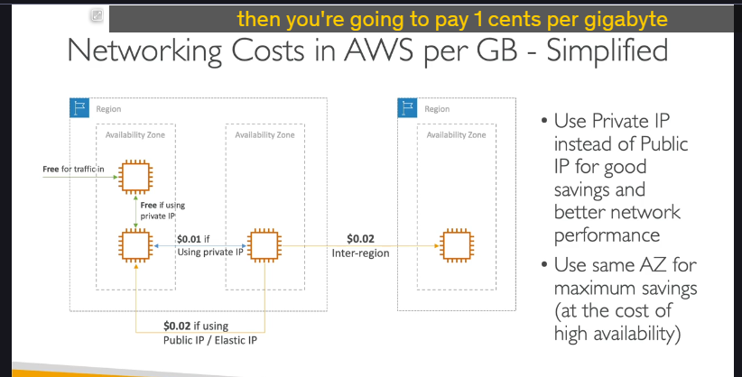
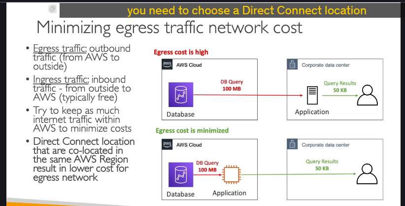
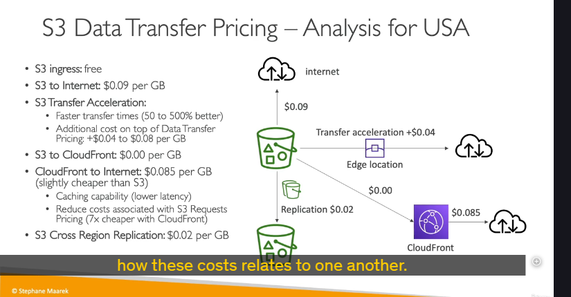
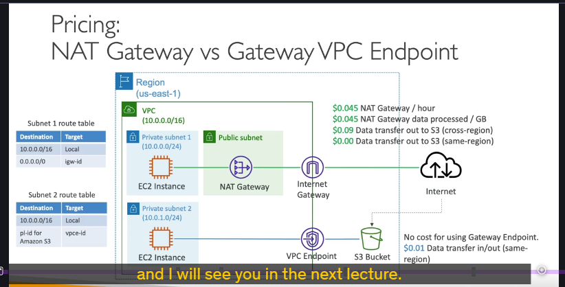

# Chi phí mạng trong AWS

## Tổng quan về chi phí mạng

Chi phí mạng trong AWS tính theo gigabyte có thể trở nên rất phức tạp, nhưng đây là cái nhìn tổng quan ở mức độ cao để giúp bạn chuẩn bị cho kỳ thi.

## Chi phí mạng cơ bản



### Trong cùng một Availability Zone (AZ)

- **Lưu lượng đến (Ingress)**: Miễn phí cho tất cả lưu lượng đi vào EC2 instances
- **Giao tiếp trong cùng AZ**: Miễn phí khi sử dụng private IP
- **Lý do**: Các AZ đại diện cho một tập hợp nhiều data center nằm gần nhau về mặt địa lý

### Giữa các Availability Zones khác nhau

- **Sử dụng Public IP hoặc Elastic IP**: $0.02 per GB
  - Lý do: Lưu lượng phải ra khỏi mạng AWS và quay lại
- **Sử dụng Private IP**: $0.01 per GB
  - Rẻ hơn một nửa vì sử dụng mạng nội bộ AWS

### Giữa các Regions khác nhau

- **Chi phí**: $0.02 per GB
- **Lưu ý**: Lưu lượng giữa các region có thể khá đắt

## Các nguyên tắc tối ưu hóa chi phí

### 1. Ưu tiên Private IP

- **Lợi ích**:
  - Tiết kiệm chi phí
  - Hiệu năng mạng tốt hơn
  - Sử dụng mạng private tự động

### 2. Cân nhắc về Availability Zone

- **Cùng AZ**: Tiết kiệm tối đa chi phí
- **Khác AZ**: Đảm bảo high availability
- **Trade-off**: Cân bằng giữa chi phí và tính sẵn sàng cao

### Ví dụ thực tế: RDS Read Replica

- **Cùng AZ**: Không tính phí network transfer
- **Khác AZ**: $0.01 per GB cho data transfer

## Tối ưu hóa Egress Traffic



### Khái niệm cơ bản

- **Egress traffic**: Lưu lượng ra ngoài (từ AWS ra bên ngoài) - **TỐN PHÍ**
- **Ingress traffic**: Lưu lượng vào trong (từ bên ngoài vào AWS) - **MIỄN PHÍ**

### Chiến lược tối ưu hóa

#### Trước khi tối ưu:

```
Corporate Data Center → Database (AWS)
↓ (100 MB data)
Application (Corporate) → Xử lý → User (50 KB)
```

**Vấn đề**: Egress traffic cao (100 MB từ AWS ra ngoài)

#### Sau khi tối ưu:

```
EC2 Instance (AWS) ↔ Database (AWS) - Miễn phí nếu cùng AZ
↓ (50 KB)
User - Chi phí thấp hơn nhiều
```

### Direct Connect

- Chọn Direct Connect location cùng AWS region để giảm chi phí egress

## Chi phí S3 Data Transfer (Khu vực USA)



### Các tình huống chi phí

| Loại Transfer            | Chi phí        | Ghi chú           |
| ------------------------ | -------------- | ----------------- |
| Upload to S3             | Miễn phí       | Ingress traffic   |
| Download from S3         | $0.09/GB       | Egress traffic    |
| S3 Transfer Acceleration | +$0.04-0.08/GB | Tăng tốc 50-500%  |
| S3 → CloudFront          | Miễn phí       | Internal transfer |
| CloudFront → Internet    | $0.085/GB      | Rẻ hơn S3 direct  |
| Cross Region Replication | $0.02/GB       | Replication cost  |

### Lợi ích của CloudFront

- **Chi phí thấp hơn**: $0.085/GB vs $0.09/GB (S3 direct)
- **Hiệu năng tốt hơn**: Caching capabilities, latency thấp
- **Request cost**: Rẻ hơn 7 lần so với S3 direct requests

## So sánh: NAT Gateway vs VPC Gateway Endpoint

## NAT Gateway (Qua Internet)

#### Kiến trúc:

```
Private Subnet → NAT Gateway → Internet Gateway → Internet → S3
```

#### Chi phí:

- **NAT Gateway**: $0.045/hour
- **Data processing**: $0.045/GB qua NAT Gateway
- **Data transfer**: $0.09/GB (cross-region) hoặc $0 (same region)

### VPC Gateway Endpoint (Kết nối trực tiếp)

#### Kiến trúc:

```
Private Subnet → VPC Gateway Endpoint → S3
```

#### Chi phí:

- **Gateway Endpoint**: **Miễn phí**
- **Data transfer**: $0.01/GB (cùng region)

* **Cost:** Gateway endpoints for S3 are offered at no cost and the routes are managed through route tables. Interface endpoints are priced at $0.01/per AZ/per hour. Cost depends on the Region, check [current pricing](https://aws.amazon.com/privatelink/pricing/). Data transferred through the interface endpoint is charged at $0.01/per GB (depending on Region).

### Kết luận

VPC Gateway Endpoint có chi phí **thấp hơn đáng kể** so với NAT Gateway và thường được kiểm tra trong kỳ thi.

## Tóm tắt các điểm quan trọng cho kỳ thi

1. **Ưu tiên Private IP** thay vì Public IP
2. **Cùng AZ** để tiết kiệm tối đa (trade-off với high availability)
3. **CloudFront** giúp giảm chi phí và tăng hiệu năng
4. **VPC Gateway Endpoint** rẻ hơn NAT Gateway cho S3 access
5. **Ingress traffic miễn phí**, **Egress traffic tốn phí**
6. **Direct Connect** cùng region giảm egress cost
