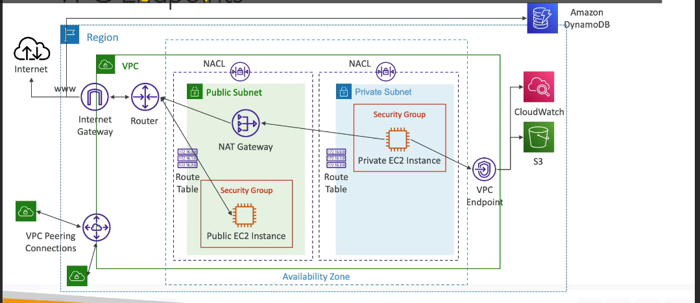
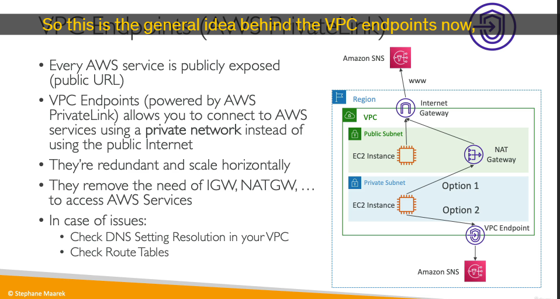
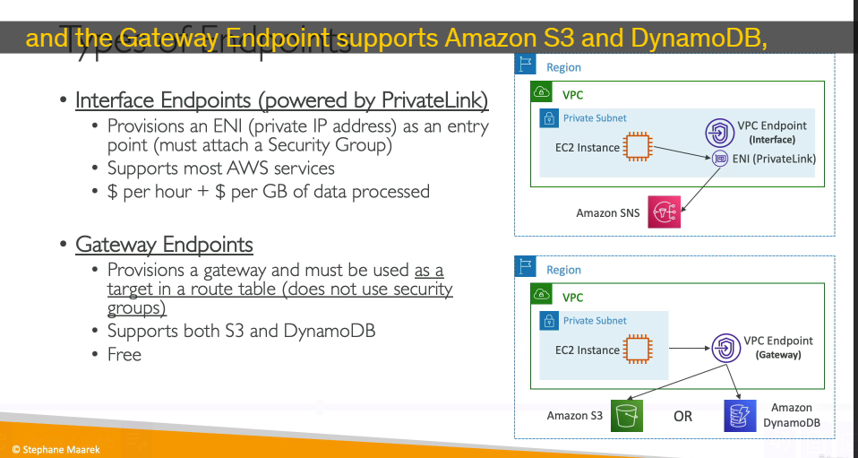

# **Vấn đề:**

- Theo mặc định, nhiều dịch vụ AWS (như DynamoDB, S3, CloudWatch, SNS, v.v.) được truy cập thông qua **Internet công cộng**.
  
- Điều này có nghĩa là lưu lượng từ VPC của bạn (ví dụ: từ phiên bản EC2 trong Private Subnet thông qua NAT Gateway và Internet Gateway) đi ra ngoài Internet, sau đó mới truy cập vào endpoint công cộng của dịch vụ AWS.
- Việc này có thể gây ra các vấn đề về bảo mật (lưu lượng đi qua Internet công cộng) và chi phí (phí truyền dữ liệu ra Internet, chi phí NAT Gateway).

# **Giải pháp: Sử dụng VPC Endpoints**

- **VPC Endpoint** cho phép các phiên bản trong VPC của bạn kết nối **trực tiếp** đến các dịch vụ AWS được hỗ trợ (hoặc các dịch vụ Endpoint được cung cấp bởi các đối tác/khách hàng AWS khác) bằng cách sử dụng **mạng riêng của AWS (private AWS network)**, thay vì phải đi qua Internet công cộng.
- Điều này đảm bảo lưu lượng giữa VPC của bạn và dịch vụ AWS **không bao giờ rời khỏi mạng Amazon**, tăng cường bảo mật và có thể giảm chi phí truyền dữ liệu ra ngoài.
- VPC Endpoints là các thành phần của VPC có khả năng mở rộng theo chiều ngang (horizontally scaled), dư thừa (redundant) và có tính sẵn sàng cao (highly available).
- Việc sử dụng VPC Endpoint có thể giúp bạn **loại bỏ sự cần thiết của Internet Gateway hoặc NAT Gateway** cho mục đích truy cập các dịch vụ AWS được hỗ trợ từ Private Subnet, từ đó **đơn giản hóa đáng kể cấu trúc mạng** của bạn.

**Cách VPC Endpoint hoạt động (Sơ đồ luồng logic):**

- Thay vì đi theo luồng: `Phiên bản Private EC2 -> NAT Gateway -> Internet Gateway -> Internet -> Dịch vụ AWS (Public Endpoint)`
- Luồng mới sẽ là: `Phiên bản Private EC2 -> (Qua VPC Endpoint) -> Dịch vụ AWS (trong mạng riêng của Amazon)`

# **Các loại VPC Endpoint:**

AWS cung cấp hai loại VPC Endpoint chính:

1. **Interface Endpoints:**

   - Được cung cấp bởi **AWS PrivateLink**. PrivateLink cho phép kết nối riêng tư đến nhiều dịch vụ AWS và dịch vụ của các nhà cung cấp thứ ba (gọi là Endpoint Services).
   - **Cách hoạt động:** Khi tạo Interface Endpoint, AWS sẽ cung cấp một hoặc nhiều **Giao diện mạng đàn hồi (Elastic Network Interface - ENI)** với các địa chỉ **IP riêng tư (Private IP)** trong các Subnet mà bạn chỉ định trong VPC của mình. Những ENI này đóng vai trò là điểm vào (entry point) cho lưu lượng truy cập vào dịch vụ AWS PrivateLink một cách riêng tư.
   - **Bảo mật:** Bạn **phải đính kèm Security Group** vào các ENI của Interface Endpoint để kiểm soát lưu lượng truy cập đến chúng.
   - **Phạm vi hỗ trợ:** Hỗ trợ **hầu hết** các dịch vụ AWS (nếu không muốn nói là tất cả các dịch vụ hiện đại) và Endpoint Services của bên thứ ba.
   - **Chi phí:** Có chi phí sử dụng. Bạn trả tiền dựa trên **số giờ hoạt động của ENI** và **lượng dữ liệu được xử lý** qua Endpoint.
   - **DNS:** Mặc định, Interface Endpoint sẽ đăng ký các bản ghi DNS riêng tư trong VPC của bạn, cho phép bạn truy cập dịch vụ bằng tên DNS mặc định của nó (ví dụ: `ec2.us-east-1.amazonaws.com`) và lưu lượng sẽ tự động được định tuyến đến ENI của Endpoint thay vì đi ra Internet.
   - **Trường hợp sử dụng:** Truy cập đa số các dịch vụ AWS một cách riêng tư từ VPC, truy cập các Endpoint Services của bên thứ ba, truy cập từ mạng On-Premises qua VPN/Direct Connect vào các dịch vụ AWS qua Interface Endpoint (cần cấu hình routing).

2. **Gateway Endpoints:**

   - Là loại VPC Endpoint cũ hơn và không sử dụng PrivateLink.
   - **Cách hoạt động:** Không cung cấp ENI hoặc IP riêng tư trong Subnet của bạn. Thay vào đó, nó cung cấp một **đích đến (target)** đặc biệt mà bạn **chỉ định trực tiếp trong Bảng Định tuyến (Route Table)** của VPC. Lưu lượng được định tuyến đến đích này sẽ tự động được chuyển đến dịch vụ AWS tương ứng trong mạng riêng của Amazon.
   - **Bảo mật:** **Không sử dụng Security Group** cho Gateway Endpoint (vì không có ENI để đính kèm SG vào).
   - **Phạm vi hỗ trợ:** Chỉ hỗ trợ **DUY NHẤT hai dịch vụ AWS**: **Amazon S3** và **Amazon DynamoDB**. Bạn cần nhớ điều này cho kỳ thi.
   - **Chi phí:** **Miễn phí**. Không có phí theo giờ hoặc phí xử lý dữ liệu cho việc sử dụng Gateway Endpoint.
   - **Khả năng mở rộng:** Tự động mở rộng vì nó chỉ là một cấu hình định tuyến.
   - **Cấu hình:** Chỉ cần tạo Endpoint và cập nhật Bảng Định tuyến của các Subnet cần truy cập dịch vụ để trỏ lưu lượng (đến dải IP công khai của S3/DynamoDB, được cung cấp dưới dạng Prefix List) đến Gateway Endpoint.
   - **Hạn chế:** Không hỗ trợ truy cập từ mạng On-Premises qua VPN/Direct Connect hoặc từ VPC khác qua Transit Gateway (khác với Interface Endpoint).

**So sánh và Lựa chọn (cho S3 và DynamoDB):**

Cả Amazon S3 và Amazon DynamoDB đều có thể được truy cập riêng tư bằng **cả hai loại Endpoint** (Gateway Endpoint và Interface Endpoint).

- **Lựa chọn ưu tiên (thường cho bài thi và hầu hết các trường hợp): Gateway Endpoint**

  - **Miễn phí.**
  - Cấu hình đơn giản hơn (chỉ cần cập nhật Bảng định tuyến).
  - Phù hợp cho các trường hợp truy cập S3/DynamoDB từ bên trong VPC mà không có các yêu cầu mạng phức tạp từ bên ngoài VPC.

- **Khi nào nên dùng Interface Endpoint cho S3/DynamoDB?**

  - Khi bạn cần truy cập S3 hoặc DynamoDB một cách riêng tư từ **mạng On-Premises** của mình (qua VPN hoặc Direct Connect). Gateway Endpoint không hỗ trợ kịch bản này.
  - Khi bạn cần định tuyến lưu lượng từ VPC khác thông qua Transit Gateway để truy cập S3/DynamoDB một cách riêng tư.
  - Đây là các trường hợp sử dụng nâng cao hơn.

**Tóm lại:**

VPC Endpoints cho phép truy cập dịch vụ AWS và dịch vụ của bên thứ ba một cách **riêng tư** mà không cần đi qua Internet công cộng, tăng cường bảo mật và có thể giảm chi phí.

- **Interface Endpoints:** Dùng PrivateLink, tạo ENI/IP riêng, hỗ trợ hầu hết dịch vụ, **có phí**, cần Security Group. Phù hợp cho đa số dịch vụ và kết nối từ On-Prem/VPC khác.
- **Gateway Endpoints:** Dùng cấu hình định tuyến, **miễn phí**, hỗ trợ **CHỈ S3 và DynamoDB**, không dùng ENI/Security Group. Thường được ưu tiên cho S3/DynamoDB khi truy cập từ bên trong VPC.

Việc lựa chọn loại Endpoint phụ thuộc vào dịch vụ bạn muốn truy cập, yêu cầu về chi phí và các yêu cầu kết nối mạng phức tạp từ bên ngoài VPC.

---

# **Mục tiêu của Lab:**

Chứng minh rằng các phiên bản EC2 trong Private Subnet có thể truy cập dịch vụ Amazon S3 một cách riêng tư thông qua VPC Endpoint (loại Gateway) mà **không cần kết nối Internet công cộng**.

**Các bước thực hiện:**

**Bước 1: Chuẩn bị Phiên bản Private EC2**

1. Đảm bảo bạn có một phiên bản EC2 đang chạy trong **Private Subnet** của VPC tùy chỉnh. (Kết nối đến nó thông qua Bastion Host nếu cần).
2. Gán một **IAM Role** cho phiên bản EC2 này, Role này có quyền truy cập cần thiết vào S3 (ví dụ: `AmazonS3ReadOnlyAccess` để có thể liệt kê các bucket).

**Bước 2: Xác nhận truy cập S3 khi CÓ Internet**

1. Trước khi bỏ kết nối Internet, hãy xác nhận rằng phiên bản Private EC2 của bạn có thể truy cập Internet (ví dụ: `curl google.com` hoạt động - điều này giả định bạn đã cấu hình NAT Gateway/NAT Instance trước đó cho Private Subnet).
2. Sử dụng AWS CLI trên phiên bản Private EC2 để kiểm tra quyền S3 (ví dụ: `aws s3 ls`).
3. **Quan sát:** Lệnh `aws s3 ls` sẽ hoạt động thành công và liệt kê các S3 bucket trong tài khoản của bạn. Điều này chứng tỏ phiên bản có thể giao tiếp với dịch vụ S3 (hiện tại là thông qua Internet công cộng qua nat rồi đến igw ).

**Bước 3: Loại bỏ Kết nối Internet khỏi Private Subnet**

1. Truy cập **AWS VPC console** -> **Route Tables**.
2. Chọn **Bảng định tuyến** liên kết với **Private Subnet** của bạn.
3. Chuyển đến tab **Routes** -> **Edit routes**.
4. **Xóa** quy tắc định tuyến mặc định (`0.0.0.0/0`) đang trỏ đến NAT Gateway hoặc NAT Instance. Hành động này **cắt đứt đường ra Internet công cộng** của Private Subnet.

**Bước 4: Xác nhận MẤT truy cập Internet và S3**

1. Quay lại phiên bản Private EC2.
2. Thử lại lệnh kiểm tra Internet: `curl google.com`.
3. **Quan sát:** Lệnh này sẽ **THẤT BẠI** (timeout) vì không còn đường ra Internet.
4. Thử lại lệnh kiểm tra S3: `aws s3 ls`.
5. **Quan sát:** Lệnh này cũng sẽ **THẤT BẠI**. Điều này xác nhận rằng trước đó, việc truy cập S3 đang đi qua Internet công cộng.

**Bước 5: Tạo VPC Endpoint (Loại Gateway cho S3)**

1. Truy cập **AWS VPC console** -> **Endpoints**.
2. Nhấp vào **Create Endpoint**.
3. **Cấu hình:**
   - **Service category:** Chọn **AWS services**.
   - **Service:** Gõ "S3" vào ô tìm kiếm và chọn dịch vụ S3. Lưu ý rằng S3 có cả loại **Gateway** và **Interface**.
   - **Type:** Chọn loại **Gateway**. (Đây là loại phổ biến và miễn phí cho S3/DynamoDB).
   - **VPC:** Chọn **VPC tùy chỉnh** của bạn (`DemoVPC`).
   - **Configure route tables:** Chọn **Bảng định tuyến** của **Private Subnet** mà bạn muốn kết nối với S3 qua Endpoint. AWS sẽ tự động thêm một quy tắc định tuyến vào bảng này.
   - **Policy:** Giữ mặc định "Full access" cho demo (trong thực tế có thể tùy chỉnh chính sách Endpoint).
   - Nhấp vào **Create endpoint**.

**Bước 6: Xác minh Bảng Định tuyến đã được cập nhật**

1. Sau khi tạo Endpoint, truy cập lại **VPC console** -> **Route Tables**.
2. Chọn **Bảng định tuyến** của **Private Subnet**.
3. Chuyển đến tab **Routes**.
4. **Quan sát:** Một quy tắc định tuyến mới cho dịch vụ S3 sẽ được tự động thêm vào. Đích (Destination) sẽ là một **Prefix List** do AWS quản lý (chứa các dải IP công khai của S3), và Đích đến (Target) sẽ là **ID của VPC Endpoint (loại Gateway)** vừa tạo (`vpce-...`). Quy tắc này không thể xóa thủ công mà phải xóa Endpoint.

**Bước 7: Xác minh truy cập S3 mà KHÔNG CÓ Internet**

1. Kết nối lại vào phiên bản Private EC2.
2. Kiểm tra lại kết nối Internet: `curl google.com`. Vẫn sẽ **THẤT BẠI** (để xác nhận chưa khôi phục Internet).
3. Thử lại lệnh kiểm tra S3: `aws s3 ls`.
4. **Quan sát:** Lệnh này có thể **thành công ngay** hoặc **thất bại ban đầu**.
5. **Lưu ý quan trọng / "Mẹo" CLI:** Đôi khi AWS CLI hoặc SDK mặc định sử dụng endpoint công khai của dịch vụ và có thể không tự động nhận ra VPC Endpoint ở Vùng hiện tại ngay lập tức, hoặc mặc định Vùng khác (ví dụ: us-east-1). Để đảm bảo CLI sử dụng Endpoint ở Vùng hiện tại của VPC:
   - Chạy lệnh với chỉ định Vùng rõ ràng: `aws s3 ls --region <Vùng_của_VPC>` (ví dụ: `aws s3 ls --region eu-central-1`).
6. **Kết quả cuối cùng:** Lệnh `aws s3 ls --region <Vùng_của_VPC>` sẽ hoạt động thành công và liệt kê các bucket S3. Điều này chứng minh rằng phiên bản Private EC2 đã truy cập S3 **thành công mà không cần đi qua Internet công cộng**, nhờ vào VPC Endpoint loại Gateway.

## cho interface gateway thì sao

**Mục tiêu:** Từ phiên bản Private EC2 (không có Internet), truy cập một dịch vụ AWS **KHÁC S3/DynamoDB** (ví dụ: Systems Manager - SSM) một cách riêng tư.

**Trạng thái ban đầu:**

- Phiên bản EC2 trong Private Subnet.
- Đã cắt kết nối Internet (xóa route 0.0.0.0/0 ra NAT/IGW).
- Có IAM Role cho phép truy cập dịch vụ mục tiêu (ví dụ: `AmazonSSMReadOnlyAccess`).

**Các bước chính (Tóm gọn):**

1. **Tạo VPC Endpoint:**
   - Vào VPC Console > Endpoints > Create Endpoint.
   - Chọn **AWS services** .
   - Tìm dịch vụ mục tiêu (ví dụ: `ssm` hoặc `ec2messages`). **Chọn loại Interface** .
   - Chọn **VPC** của bạn.
   - Chọn **Subnet private** (một hoặc nhiều ở các AZ có ec2 Private cần truy cập) để đặt **ENI** (card mạng ảo) của Endpoint.
   - Đảm bảo tùy chọn [**Enable DNS name**](./ly-thuyet-khac/dns-name-interGW.md) (cho Private DNS) được bật (thường là mặc định).
   - Chọn hoặc tạo **Security Group** cho Endpoint này (cần cho phép lưu lượng **chiều vào** từ Security Group/CIDR của phiên bản Private EC2 trên cổng mà dịch vụ SSM sử dụng - ví dụ: 443).
   - Nhấp Create Endpoint. (Endpoint sẽ tạo ra ENI với IP riêng trong Subnet bạn chọn).
2. **Kiểm tra từ Phiên bản Private EC2:**
   - SSH vào phiên bản Private EC2 (qua Bastion Host).
   - Chạy lệnh AWS CLI cho dịch vụ mục tiêu (ví dụ: `aws ssm describe-instances --region <Vùng_của_VPC>`).
   - Lệnh sẽ hoạt động thành công.

**Khác biệt chính so với Lab Gateway Endpoint:**

- Sử dụng **loại Interface** và chọn **Subnet** để đặt **ENI** (với IP riêng tư), không phải loại Gateway và chọn Route Table.
- Áp dụng cho **nhiều dịch vụ hơn** S3/DynamoDB.
- **Cần cấu hình Security Group** cho Endpoint ENI.
- **Mất phí** (theo giờ hoạt động của ENI + dữ liệu xử lý).
- **Không cần sửa Route Table thủ công** cho dịch vụ (với Private DNS enabled, tên miền dịch vụ tự phân giải sang IP riêng của ENI).
