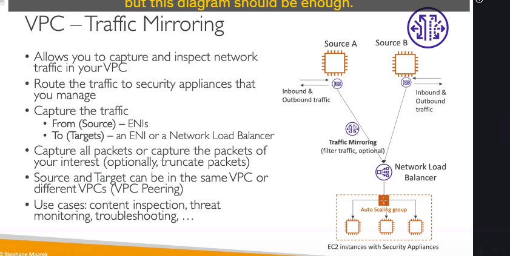

### VPC Traffic Mirroring là gì?

**VPC Traffic Mirroring** là một tính năng của AWS cho phép bạn sao chép (copy) lưu lượng mạng từ một **Elastic Network Interface (ENI)** của một EC2 instance và gửi bản sao đó đến một đích khác để phân tích.

Quá trình này diễn ra một cách **hoàn toàn thụ động và không xâm lấn (non-intrusive)**, nghĩa là EC2 instance nguồn không hề bị ảnh hưởng về hiệu năng và cũng không hề biết rằng traffic của nó đang được sao chép.

---

### Kiến trúc và Cách hoạt động 🕵️‍♂️

Để thiết lập Traffic Mirroring, bạn cần xác định ba thành phần chính:

1.  **Source (Nguồn):** Là các **ENI** mà bạn muốn theo dõi. Bạn có thể chọn một hoặc nhiều ENI làm nguồn.
2.  **Target (Đích):** Là nơi mà traffic được sao chép sẽ được gửi đến. Đích có thể là:
    - Một **ENI** của một EC2 instance khác (thường là máy cài đặt sẵn các công cụ phân tích).
    - Một **Network Load Balancer (NLB)**. Đây là lựa chọn phổ biến nhất, vì NLB có thể phân tải traffic được nhân bản đến một nhóm các EC2 instance (Auto Scaling Group) chuyên dụng cho việc phân tích, đảm bảo tính sẵn sàng và khả năng mở rộng cho hệ thống giám sát.
3.  **Filter (Bộ lọc - Tùy chọn):** Bạn có thể tạo các bộ lọc để chỉ sao chép một phần traffic cụ thể (ví dụ: chỉ traffic TCP trên cổng 443) thay vì toàn bộ, giúp giảm lượng dữ liệu cần phân tích.

**Luồng hoạt động:**

- EC2 instance nguồn (Source A) hoạt động bình thường, nhận và gửi traffic qua ENI của nó.
- Tính năng Traffic Mirroring tạo ra một bản sao của tất cả (hoặc một phần, nếu có filter) traffic này.
- Bản sao traffic được chuyển tiếp đến đích đã chỉ định (ví dụ: Network Load Balancer).
- NLB phân phối traffic này đến các EC2 instance trong nhóm giám sát để thực hiện phân tích sâu.

---

### Các ràng buộc và trường hợp sử dụng

- **Ràng buộc:** Nguồn và Đích phải nằm trong **cùng một VPC**, hoặc trong các VPC khác nhau đã được kết nối với nhau bằng **VPC Peering**.
- **Các trường hợp sử dụng chính:**
  - **Content Inspection:** Kiểm tra nội dung của các gói tin để phát hiện rò rỉ dữ liệu nhạy cảm.
  - **Threat Monitoring:** Giám sát các mẫu traffic bất thường, phát hiện mã độc, hoặc các dấu hiệu của một cuộc tấn công mạng.
  - **Troubleshooting:** Gỡ lỗi các vấn đề mạng phức tạp bằng cách phân tích chi tiết các gói tin mà không cần can thiệp trực tiếp vào instance đang gặp sự cố.
