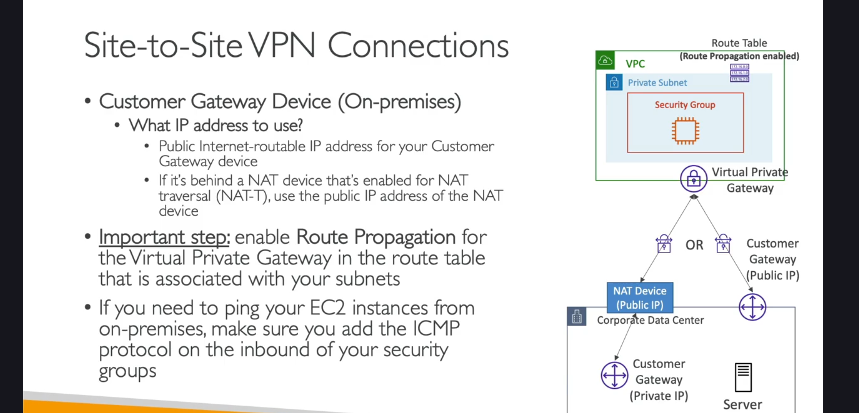
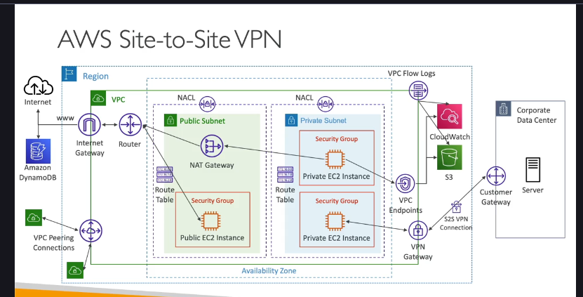

### **Tổng quan về AWS Site-to-Site VPN** 🏢-to-☁️

**AWS Site-to-Site VPN** cho phép bạn tạo một kết nối **riêng tư và mã hóa** giữa trung tâm dữ liệu tại chỗ (on-premises corporate data center) và VPC (Virtual Private Cloud) của bạn trên AWS. Mặc dù kết nối này đi qua **mạng Internet công cộng**, toàn bộ dữ liệu được mã hóa để đảm bảo tính bảo mật.

Đây là giải pháp nền tảng để xây dựng một môi trường hybrid cloud, nơi các tài nguyên on-premises và trên cloud có thể giao tiếp với nhau một cách an toàn.

---

### **Các Thành phần Chính**

Để thiết lập một Site-to-Site VPN, bạn cần hai thành phần cốt lõi:

#### 1. **Virtual Private Gateway (VGW)**

- Đây là bộ tập trung VPN (VPN concentrator) ở phía **AWS**.
- Bạn sẽ **tạo VGW và gắn nó vào VPC** mà bạn muốn kết nối.
- [Bạn có thể tùy chỉnh số ASN (Autonomous System Number) cho VGW nếu cần thiết cho việc định tuyến BGP (Border Gateway Protocol).](./ly-thuyet-khac/asn-bgp-concepts.md)

#### 2. **Customer Gateway (CGW)**

- Đây là một thiết bị **vật lý hoặc phần mềm** nằm ở phía **trung tâm dữ liệu của bạn** (on-premises).
- Nó đại diện cho điểm cuối của kết nối VPN phía bạn.
- AWS có một danh sách các thiết bị từ các nhà cung cấp đã được kiểm thử để tương thích.

---

### **Quy trình Thiết lập và Những Lưu ý Quan trọng (Cho Phỏng vấn)**

Đây là những điểm kỹ thuật quan trọng mà nhà tuyển dụng thường hỏi để kiểm tra hiểu biết sâu của bạn.

#### **1. Cấu hình IP cho Customer Gateway (CGW)**

- **Trường hợp 1: CGW có IP công cộng (Public IP)**
  - Nếu thiết bị gateway của bạn có một địa chỉ IP public có thể định tuyến trên Internet, bạn chỉ cần dùng IP này để cấu hình CGW trên AWS.
- **Trường hợp 2: CGW có IP riêng (Private IP)**
  - Đây là kịch bản phổ biến. Thiết bị gateway của bạn nằm sau một thiết bị NAT (ví dụ: firewall).
  - **Câu hỏi phỏng vấn:** Bạn sẽ dùng IP nào để khai báo cho CGW trên AWS?
  - **Trả lời:** Bạn phải sử dụng **địa chỉ IP công cộng (Public IP) của thiết bị NAT**. Thiết bị NAT đó cũng phải được bật tính năng **NAT-T (NAT Traversal)**.

#### **2. Kích hoạt Route Propagation (Lan truyền Tuyến đường)**

- **Vấn đề:** Sau khi bạn đã thiết lập kết nối VPN thành công (trạng thái "UP"), traffic vẫn chưa thể đi từ on-premises vào VPC và ngược lại.
- **Giải pháp:** Bạn phải vào **Route Table** của các subnet trong VPC và **kích hoạt "Route Propagation"** từ Virtual Private Gateway (VGW).
- **Giải thích:** Hành động này sẽ tự động thêm một route vào Route Table, hướng tất cả traffic có đích đến là dải IP của mạng on-premises đi qua VGW. Nếu không có bước này, các EC2 instance trong subnet sẽ không biết đường đi đến mạng của bạn.

#### **3. Cho phép Ping (Giao thức ICMP)**

- **Vấn đề:** Bạn không thể `ping` các EC2 instance từ máy chủ on-premises dù kết nối VPN đã thông.
- **Giải pháp:** Đây là vấn đề của **Security Group**. Bạn cần vào Security Group của EC2 instance và thêm một **Inbound Rule** cho phép giao thức **ICMP** từ dải IP của mạng on-premises.
- **Mẹo phỏng vấn:** Các câu hỏi thường kết hợp nhiều dịch vụ. Họ sẽ mô tả một kịch bản về Site-to-Site VPN nhưng gốc rễ vấn đề lại nằm ở cấu hình Security Group.

---

### **Mở rộng: AWS VPN CloudHub** HUB-AND-SPOKE

**AWS VPN CloudHub** là một mô hình kiến trúc cho phép bạn kết nối **nhiều trung tâm dữ liệu (nhiều site) lại với nhau** bằng cách sử dụng AWS VPC làm trung tâm (hub).

#### **Cách hoạt động:**

1.  Bạn có một VPC duy nhất với một **Virtual Private Gateway (VGW)**.
2.  Mỗi trung tâm dữ liệu (chi nhánh văn phòng) của bạn sẽ có một **Customer Gateway (CGW)** riêng.
3.  Bạn thiết lập nhiều kết nối Site-to-Site VPN từ mỗi CGW đến **cùng một VGW**.
4.  Sau khi cấu hình, các trung tâm dữ liệu này có thể **giao tiếp trực tiếp với nhau** thông qua hub là VGW trên AWS.

#### **Đặc điểm chính:**

- **Mô hình Hub-and-Spoke:** Đơn giản và chi phí thấp để kết nối nhiều địa điểm.
- **Traffic qua Internet:** Toàn bộ traffic giữa các site đều đi qua VGW trên Internet công cộng, nhưng được mã hóa an toàn bằng VPN.
- **Thiết lập:** Cực kỳ đơn giản, chỉ cần tạo nhiều kết nối VPN đến cùng một VGW và cấu hình route table một cách phù hợp (sử dụng định tuyến động - dynamic routing).
