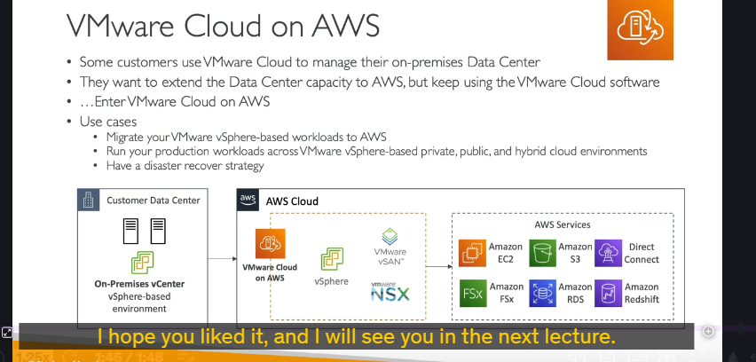

## Bối cảnh: Khi "Dân VMware" muốn "Chơi với Mây" ☁️🤝🏢

- Nhiều công ty, tổ chức hiện đang sử dụng **VMware** (cụ thể là các môi trường dựa trên **vSphere**) để quản lý trung tâm dữ liệu (data center) tại chỗ (on-premises) của họ. Họ đã quen với việc quản lý máy ảo (VMs) qua các công cụ của VMware.
- Khi những công ty này muốn mở rộng năng lực hạ tầng của mình lên đám mây, đặc biệt là AWS, họ thường có một mong muốn: **vẫn muốn tiếp tục sử dụng phần mềm quản lý quen thuộc của VMware** để điều khiển cả tài nguyên on-premises lẫn tài nguyên trên cloud. Họ không muốn phải học lại từ đầu một hệ thống quản lý hoàn toàn mới.

Đó chính là lý do **VMware Cloud on AWS** ra đời!

---

## VMware Cloud on AWS là gì? 🤔

Rất đơn giản, **VMware Cloud on AWS** cho phép bạn **chạy toàn bộ nền tảng phần mềm của VMware (mà bạn đã biết) trực tiếp trên hạ tầng phần cứng của AWS.**

- Bạn có thể mở rộng cơ sở hạ tầng VMware Cloud của mình lên AWS.
- Các công nghệ cốt lõi của VMware như vSphere (quản lý máy ảo), vSAN (lưu trữ ảo hóa), NSX (mạng ảo hóa)... sẽ chạy trên các server vật lý của AWS.
  - (Bạn không cần biết chi tiết vSphere, vSAN, NSX là gì, chỉ cần hiểu chúng là các thành phần của VMware).

---

## Tại sao lại dùng VMware Cloud on AWS? Các trường hợp sử dụng thực tế 🌟

1. **Mở rộng Năng lực (Extend Capacity):**

   - Dễ dàng tăng thêm sức mạnh tính toán (computing power) hoặc dung lượng lưu trữ (storage) từ trung tâm dữ liệu on-premises của bạn lên "đám mây" AWS mà không gặp nhiều trở ngại. Cần thêm tài nguyên? Có AWS lo!

2. **Di chuyển Máy ảo VMware lên AWS (Migrate Workloads):**

   - Đơn giản hóa việc di chuyển các ứng dụng, máy ảo đang chạy trên nền tảng VMware ở on-premises lên AWS.

3. **Môi trường Lai (Hybrid Cloud):**

   - Chạy các ứng dụng quan trọng (production workloads) trải dài trên nhiều trung tâm dữ liệu, bao gồm cả môi trường riêng (private cloud - on-premises), công cộng (public cloud - AWS), tạo thành một môi trường lai thực thụ.

4. **Chiến lược Phục hồi sau Thảm họa (Disaster Recovery - DR):**

   - Cung cấp một giải pháp DR hiệu quả. Nếu trung tâm dữ liệu on-premises gặp sự cố, bạn có thể nhanh chóng chuyển hướng hoạt động sang môi trường VMware trên AWS, vì bạn vẫn dùng chung một bộ công cụ quản lý quen thuộc.

5. **Truy cập và Tận dụng các Dịch vụ AWS Gốc:**

   - Khi hạ tầng VMware của bạn đã "hạ cánh" trên AWS, bạn có thể bắt đầu **kết nối và sử dụng các dịch vụ tuyệt vời khác của AWS** như:
     - Amazon EC2 (máy chủ ảo)
     - Amazon FSx (dịch vụ file server)
     - Amazon S3 (lưu trữ đối tượng)
     - Amazon RDS (cơ sở dữ liệu quan hệ)
     - AWS Direct Connect (kết nối riêng)
     - Amazon Redshift (kho dữ liệu)
     - ...và nhiều hơn nữa!

---

## "Chốt hạ" cho kỳ thi 📝

Khi nói đến **VMware Cloud on AWS**, bạn chỉ cần nhớ những ý chính sau:

- Đây là giải pháp cho phép **chạy phần mềm VMware trên hạ tầng AWS**.
- Đối tượng chính là những khách hàng **đã và đang sử dụng VMware** và muốn:
  - Có một giải pháp **hybrid cloud** (kết hợp on-premises và AWS).
  - **Di chuyển lên AWS một cách mượt mà**, sử dụng lại kiến thức và công cụ VMware hiện có.
- Lợi ích chính: **mở rộng tài nguyên linh hoạt, di chuyển dễ dàng hơn, có giải pháp DR tốt, và có thể tích hợp với các dịch vụ AWS gốc.**
