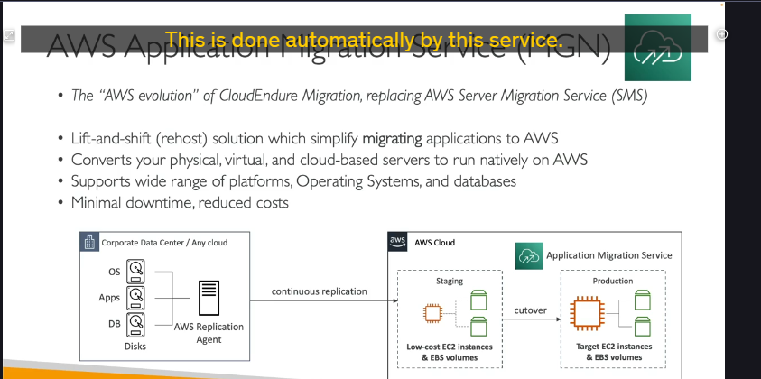

## Khi nào cần "Dọn nhà" lên Cloud? ☁️➡️🏠

hai kịch bản chính khi làm việc với cloud:

1. **Xây mới hoàn toàn (Start Fresh):** Bạn bắt đầu mọi thứ trực tiếp trên cloud. Trường hợp này thì khỏe, không cần di chuyển gì cả.
2. **Di chuyển từ On-Premises (Migrate):** Bạn đã có sẵn máy chủ, trung tâm dữ liệu đang chạy ở nhà và giờ muốn chuyển chúng lên AWS. Đây chính là lúc chúng ta cần lên kế hoạch di chuyển cẩn thận.

Và để kế hoạch này "đâu ra đó", AWS có những công cụ rất hữu ích.

---

## Bước 1: Lên Kế hoạch Di chuyển với AWS Application Discovery Service 🗺️

Trước khi dọn nhà, mình phải khảo sát xem có bao nhiêu đồ đạc, đồ nào quan trọng, đồ nào liên quan đến nhau đúng không? **AWS Application Discovery Service** chính là công cụ giúp bạn làm việc đó.

- **Mục đích:**

  - Quét (scan) các máy chủ on-premise của bạn.
  - Thu thập thông tin về **mức độ sử dụng tài nguyên của server (server utilization data)**.
  - Xây dựng **bản đồ phụ thuộc (dependency mapping)** giữa các server.

- **Tại sao quan trọng?** Những thông tin này giúp bạn hiểu rõ hệ thống hiện tại, quyết định nên di chuyển cái gì trước, cái gì sau, và di chuyển như thế nào cho hợp lý.
- **Có hai cách để "khám phá":**

  1. **Khám phá không cần Agent (Agentless Discovery) thông qua Connector:**
     - Cung cấp thông tin về máy ảo (VMs), cấu hình, lịch sử hiệu năng (CPU, bộ nhớ, dung lượng ổ đĩa).
     - Ít "xâm nhập" hơn vào server.
  2. **Khám phá bằng Agent (Application Discovery Agent):**
     - Bạn cài một agent nhỏ lên từng máy ảo.
     - Cung cấp thông tin chi tiết hơn từ bên trong VM: cấu hình hệ thống, hiệu năng, các tiến trình đang chạy, và đặc biệt là **chi tiết các kết nối mạng** giữa các hệ thống – rất tốt để xây dựng bản đồ phụ thuộc.

- **Xem kết quả ở đâu?** Toàn bộ dữ liệu thu thập được có thể được xem và phân tích trong một dịch vụ khác tên là **AWS Migration Hub**.

Nói tóm lại, Application Discovery Service giúp bạn "vẽ bản đồ" chi tiết những gì cần chuyển và chúng kết nối với nhau ra sao.

---

## Bước 2: Thực Thi Di chuyển với AWS Application Migration Service (MGN) 🚚💨

Sau khi đã có kế hoạch chi tiết, giờ là lúc "chuyển đồ". Và **AWS Application Migration Service (MGN)** là trợ thủ đắc lực nhất cho việc này.

- **Tên gọi khác:** Trước đây dịch vụ này có tên là **CloudEndure Migration**, giờ đã được đổi tên và cải tiến thành MGN.
- **Làm được gì?** MGN giúp bạn thực hiện chiến lược di chuyển **Rehosting** (hay còn gọi là **Lift-and-Shift**). Tức là bạn "bê nguyên trạng" các máy chủ vật lý, máy ảo, hoặc thậm chí các server đang chạy trên cloud khác, sang chạy một cách tự nhiên (natively) trên AWS.
- **Cách hoạt động (khá là thông minh!):**

  1. **Cài đặt Agent:** Bạn cài một **replication agent** (agent sao chép) lên các máy chủ trong trung tâm dữ liệu của bạn (nơi có hệ điều hành, ứng dụng, database đang chạy trên các ổ đĩa).
  2. **Sao chép liên tục (Continuous Replication):** Agent này sẽ liên tục sao chép dữ liệu từ ổ đĩa của bạn lên AWS. Dữ liệu này ban đầu có thể được lưu trên các **EC2 instance chi phí thấp** (staging instances) và **EBS volumes** tương ứng.
  3. **Ngày Cắt Chuyển (Cutover):** Khi bạn đã sẵn sàng, bạn thực hiện "cutover". Lúc này, hệ thống sẽ chuyển từ môi trường staging sang môi trường production. Bạn có thể chọn các **EC2 instance lớn hơn, đúng kích thước bạn cần** và các EBS volumes với hiệu năng phù hợp.

  - _Ý tưởng chính là: Sao chép dữ liệu liên tục và đến một thời điểm thích hợp thì "chuyển hẳn công tắc" sang dùng trên AWS._

- **Lợi ích của MGN:**

  - Hỗ trợ **đa dạng các nền tảng, hệ điều hành và cơ sở dữ liệu.**
  - **Thời gian ngừng hoạt động (downtime) tối thiểu.** Vì dữ liệu đã được đồng bộ gần như liên tục.
  - **Giảm chi phí di chuyển.** Bạn không cần thuê các kỹ sư có chuyên môn quá phức tạp để thực hiện việc di chuyển, vì dịch vụ này tự động hóa rất nhiều công đoạn.

---

## Ghi nhớ cho kỳ thi ! 🧠

- **AWS Application Discovery Service:** Dùng để **LÊN KẾ HOẠCH** di chuyển. Giúp bạn hiểu rõ hệ thống on-premise (server utilization, dependency mapping). Có 2 kiểu: agentless và agent-based.
- **AWS Application Migration Service (MGN):** Dùng để **THỰC THI** di chuyển. Chuyên cho **Rehosting (Lift-and-Shift)**. Hoạt động bằng cách sao chép liên tục rồi thực hiện cutover.
- Cặp đôi này thường đi cùng nhau: Discovery trước, MGN sau.
