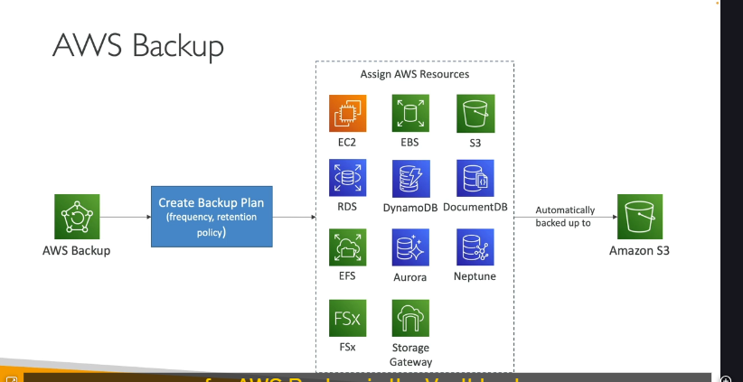

Chào bạn! Mình đây rồi, sẵn sàng cùng bạn "ngâm cứu" bài giảng tiếp theo về **AWS Backup**. Dịch vụ này cũng khá hay ho và quan trọng đấy, nhất là khi mình muốn có một chiến lược sao lưu dữ liệu bài bản trên AWS. Cùng xem nó có gì đặc biệt nhé!

---

## AWS Backup là gì? 🛡️

**AWS Backup** là một dịch vụ **được quản lý hoàn toàn (fully managed)**, giúp bạn **quản lý tập trung và tự động hóa** việc sao lưu dữ liệu trên rất nhiều dịch vụ khác nhau của AWS.

- **Mục tiêu chính:** Có một nơi duy nhất để bạn kiểm soát toàn bộ chiến lược backup của mình.
  - Không cần phải viết script phức tạp.
  - Không cần quy trình thủ công rườm rà.
  - Mọi thứ được gom về một mối, dễ theo dõi và quản lý.

---

## Các dịch vụ được AWS Backup hỗ trợ ⚙️

Danh sách các dịch vụ mà AWS Backup có thể "chăm sóc" ngày càng dài, nhưng đây là những cái tên nổi bật được nhắc đến:

- **Máy chủ ảo & Lưu trữ khối:** Amazon EC2, EBS.
- **Lưu trữ đối tượng:** Amazon S3.
- **Cơ sở dữ liệu quan hệ:** RDS (hỗ trợ tất cả các database engines như MySQL, PostgreSQL, SQL Server, Oracle, MariaDB), và dĩ nhiên là Amazon Aurora.
- **Cơ sở dữ liệu NoSQL:** DynamoDB, DocumentDB, Amazon Neptune.
- **Hệ thống tệp:** EFS (Elastic File System), FSx (bao gồm cả Lustre và Windows File Server).
- **Cổng lưu trữ:** AWS Storage Gateway (ví dụ như Volume Gateway).
- Và nhiều dịch vụ khác nữa sẽ được bổ sung theo thời gian.

Ý chính là bạn nắm được khái niệm, và các dịch vụ quan trọng nhất đã được liệt kê.

---

## Những tính năng "đáng đồng tiền bát gạo" của AWS Backup 🌟

- **Sao lưu chéo vùng (Cross-Region Backups):**

  - Cho phép bạn đẩy các bản sao lưu sang một AWS Region khác.
  - Rất quan trọng cho chiến lược **Disaster Recovery** (Phục hồi sau thảm họa).

- **Sao lưu chéo tài khoản (Cross-Account Backups):**

  - Hữu ích nếu bạn sử dụng nhiều tài khoản AWS trong chiến lược của mình.

- **Phục hồi tại một thời điểm cụ thể (Point-in-Time Recovery - PITR):**

  - Hỗ trợ cho các dịch vụ cho phép, ví dụ như Aurora. Giúp bạn khôi phục dữ liệu về chính xác một thời điểm mong muốn.

- **Sao lưu theo yêu cầu (On-Demand) và theo lịch trình (Scheduled):**

  - Bạn có thể backup ngay lập tức khi cần, hoặc đặt lịch tự động.

- **Chính sách sao lưu dựa trên thẻ (Tag-Based Backup Policies):**

  - Chỉ backup những tài nguyên được gắn thẻ nhất định (ví dụ: chỉ backup những server có tag "production").

- **Kế hoạch Sao lưu (Backup Plans):** Đây là trái tim của việc cấu hình!
  - **Tần suất (Frequency):** Ví dụ, mỗi 12 giờ, hàng tuần, hàng tháng, hoặc theo một biểu thức cron tùy chỉnh.
  - **Cửa sổ Sao lưu (Backup Window):** Khoảng thời gian bạn muốn việc sao lưu diễn ra.
  - **Chuyển sang Lưu trữ Lạnh (Transition to Cold Storage):**
    - Bạn có thể chọn không bao giờ chuyển, hoặc chuyển sau một số ngày, tuần, tháng, năm nhất định (ví dụ: chuyển sang S3 Glacier hoặc S3 Glacier Deep Archive để tiết kiệm chi phí).
  - **Thời gian Lưu giữ (Retention Period):**
    - Bản backup sẽ được giữ trong bao lâu: vài ngày, tuần, tháng, năm, hoặc giữ mãi mãi.

---

## AWS Backup hoạt động như thế nào? 🤔

1.  Bạn tạo một **Kế hoạch Sao lưu (Backup Plan)** như đã mô tả ở trên.
2.  Bạn **gán (assign)** các tài nguyên AWS cụ thể (EC2 instances, RDS databases, v.v.) mà bạn muốn sao lưu vào kế hoạch đó.
3.  Xong! AWS Backup sẽ tự động sao lưu dữ liệu của bạn vào một **S3 bucket nội bộ**, được quản lý riêng bởi dịch vụ AWS Backup. Bạn không cần phải trực tiếp quản lý bucket này.

---

## Tính năng "Bất khả xâm phạm": AWS Backup Vault Lock 🔒

Đây là một tính năng rất quan trọng bạn cần biết!

- **Khái niệm:** Backup Vault Lock thực thi chính sách **WORM (Write Once, Read Many)**. Điều này có nghĩa là một khi dữ liệu đã được ghi (backup), nó không thể bị sửa đổi hay xóa đi trong suốt thời gian lưu giữ đã định.
- **Lợi ích to lớn:**
  - Đảm bảo rằng các bản sao lưu của bạn **không thể bị xóa**, dù là vô tình hay do hành động phá hoại.
  - Cung cấp một lớp bảo vệ bổ sung chống lại việc cập nhật làm thay đổi hoặc rút ngắn thời gian lưu giữ.
  - **Ngay cả root user (tài khoản quản trị cao nhất) cũng không thể xóa các bản sao lưu** khi Vault Lock được kích hoạt.
- **Ý nghĩa:** Mang lại sự đảm bảo cực kỳ mạnh mẽ về tính an toàn và toàn vẹn của các bản sao lưu, giúp bạn tuân thủ các quy định về lưu trữ dữ liệu.

---

## Mang gì vào phòng thi? 📝

Khi nói về AWS Backup, hãy nhớ:

1.  Đây là dịch vụ **quản lý tập trung, tự động hóa** việc sao lưu.
2.  **Hỗ trợ đa dạng dịch vụ** AWS.
3.  Các tính năng chính: **Cross-Region & Cross-Account Backups**, **PITR**, **Backup Plans** (với Frequency, Backup Window, Transition to Cold Storage, Retention Period).
4.  **AWS Backup Vault Lock:** Tính năng WORM, ngăn chặn việc xóa/sửa backup, kể cả bởi root user. Đây là điểm nhấn quan trọng về bảo mật!
