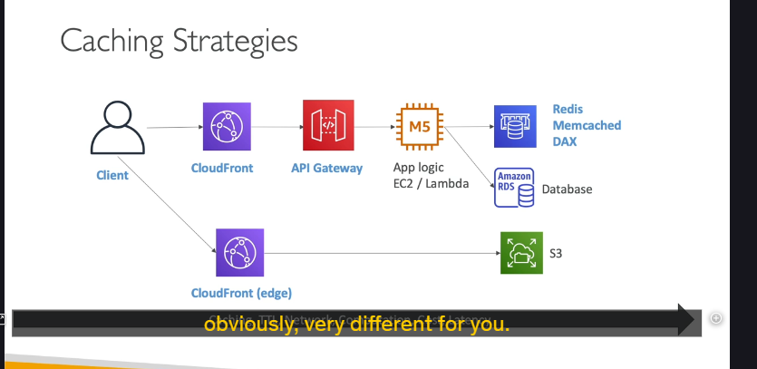

Đây là một kỹ thuật cực kỳ quan trọng để tăng tốc độ ứng dụng, giảm tải cho backend và cải thiện trải nghiệm người dùng. Cùng xem chúng ta có thể đặt cache ở những đâu và mỗi vị trí có ý nghĩa gì nhé!

---

## Kiến trúc tham khảo 🏗️

Để dễ hình dung, bài giảng đưa ra một kiến trúc ứng dụng khá phổ biến:

- **Luồng nội dung động (Dynamic Content):**
  Client ➡️ CloudFront ➡️ API Gateway ➡️ Application Logic (EC2/Lambda) ➡️ Internal Cache (ví dụ: Redis, Memcached, hoặc DAX cho DynamoDB) ➡️ Database.
- **Luồng nội dung tĩnh (Static Content):**
  Client ➡️ CloudFront ➡️ Amazon S3.

Giờ chúng ta sẽ "soi" xem cache có thể được đặt ở đâu trong kiến trúc này.

---

## Các Lớp Caching và Đặc điểm 🧐

### 1. CloudFront (Caching ở Biên - Edge Caching) 🌏

- **Vị trí:** CloudFront đặt cache ở các **Edge Location** trên toàn cầu, tức là **càng gần người dùng cuối càng tốt**.
- **Lợi ích:**
  - Nếu người dùng "đụng" trúng cache (cache hit), phản hồi sẽ **siêu nhanh** vì dữ liệu được trả về từ edge location gần nhất.
- **Rủi ro/Cân nhắc:**
  - Vì cache nằm ở biên, có khả năng dữ liệu ở backend (phía server gốc) đã thay đổi mà cache ở CloudFront chưa kịp cập nhật (outdated).
  - **Giải pháp:** Sử dụng **TTL (Time-To-Live)** – thời gian sống của cache. Hết TTL, CloudFront sẽ lấy lại dữ liệu mới từ backend.
  - Bạn cần cân bằng giữa việc cache bao lâu ở biên để có tốc độ nhanh và việc đảm bảo dữ liệu đủ "tươi" (fresh).

### 2. API Gateway (Caching ở Cấp Khu vực - Regional Caching) 🗺️

- **Vị trí:** API Gateway cũng có khả năng caching. Cache này nằm ở **cấp khu vực (regional)**, không phải ở tận biên như CloudFront.
- **Lưu ý:**
  - Ngay cả khi cache được hit ở API Gateway, vẫn có một độ trễ mạng nhất định giữa client và API Gateway.
  - API Gateway caching có thể được sử dụng độc lập, không nhất thiết phải đi kèm CloudFront.

### 3. Internal Cache của Application Logic (Ví dụ: ElastiCache - Redis/Memcached, DAX cho DynamoDB) 🧠

- **Vị trí:** Nằm giữa Application Logic (EC2, Lambda) và Database.
- **Mục đích:**
  - Bản thân Application Logic thường không tự làm caching, mà nó sẽ sử dụng các dịch vụ cache chuyên dụng này.
  - **Tránh việc truy vấn liên tục vào database** (vì database thường không có lớp caching riêng cho các truy vấn ứng dụng).
  - Lưu kết quả của các truy vấn thường xuyên hoặc các truy vấn phức tạp, tốn nhiều tài nguyên.
- **Lợi ích:**
  - **Giảm áp lực (pressure)** lên database.
  - **Tăng thông lượng đọc (read capacity)** cho ứng dụng.

### 4. Về Database và Amazon S3 🗄️📦

- **Database (ví dụ RDS) và Amazon S3 không được xem là có lớp caching mà ứng dụng trực tiếp cấu hình cho các truy vấn thường xuyên.** Chúng là nguồn dữ liệu gốc (source of truth) mà các lớp cache phía trước bảo vệ.
- (Tất nhiên, S3 khi kết hợp với CloudFront thì CloudFront đóng vai trò cache. Database cũng có các bộ đệm nội bộ, nhưng ở đây chúng ta đang nói về các lớp cache mà kiến trúc sư chủ động đưa vào).

---

## Nguyên tắc chung về các lớp Caching 🌊

- Càng di chuyển "sâu" vào bên trong stack (từ CloudFront vào đến Internal Cache gần Database), thì có thể càng nhiều chi phí tính toán và độ trễ đã phát sinh trước khi một yêu cầu "chạm" tới được lớp cache đó.
- **Không có cách làm caching nào là "đúng" hay "sai" tuyệt đối.** Tất cả phụ thuộc vào mục tiêu bạn muốn đạt được và cách bạn thiết kế ứng dụng.

---

## Những câu hỏi then chốt khi thiết kế chiến lược Caching 🤔

Khi quyết định chiến lược caching, bạn cần tự hỏi:

- **Nên cache ở đâu?** (CloudFront, API Gateway, Internal Cache, hay kết hợp?)
- **Cache như thế nào?** (Nội dung gì được cache?)
- **Cache trong bao lâu?** (Thiết lập TTL)
- **Chúng ta có chấp nhận được một chút độ trễ hoặc dữ liệu có thể hơi cũ không?** (Trade-off giữa tốc độ và tính "tươi" của dữ liệu)
- **Nội dung nào thực sự cần được cache?**

---

## "Mẹo" cho kỳ thi 💡

Bài giảng này không chỉ cho bạn một công thức cố định "bạn nên làm thế này", mà muốn bạn hiểu rằng:

- Caching có thể được triển khai ở **nhiều lớp** trong kiến trúc AWS.
- Mỗi lớp cache có những **đặc điểm riêng** (gần người dùng, phạm vi khu vực, khả năng dữ liệu cũ...).
- Việc lựa chọn chiến lược caching phụ thuộc hoàn toàn vào **yêu cầu cụ thể của ứng dụng** và các **đánh đổi (trade-offs)** mà bạn sẵn sàng chấp nhận.
- Hiểu rõ các lựa chọn và cân nhắc này sẽ giúp bạn trả lời các câu hỏi tình huống trong kỳ thi.

Hy vọng với phần giải thích này, bạn đã có cái nhìn rõ ràng hơn về các chiến lược caching trên AWS. Đây là một chủ đề rất thực tế và hữu ích! Nếu có gì băn khoăn, cứ hỏi mình nhé!
