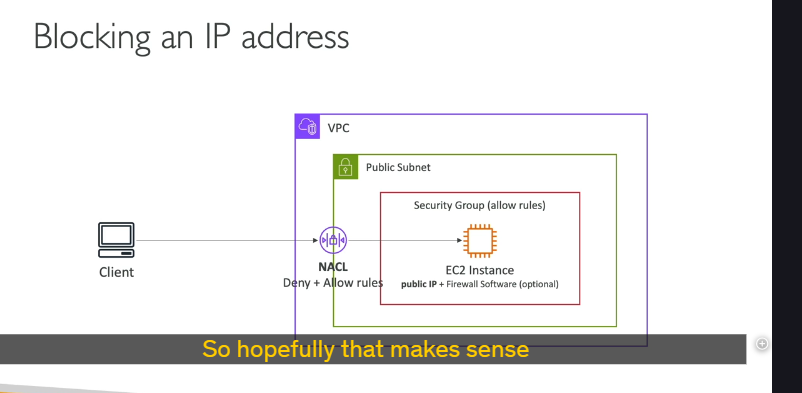
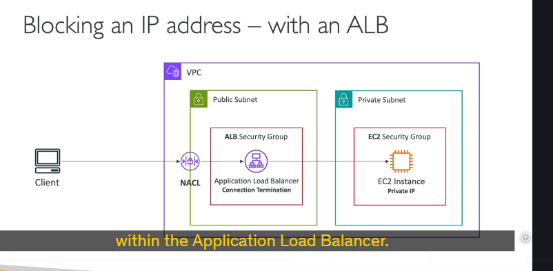
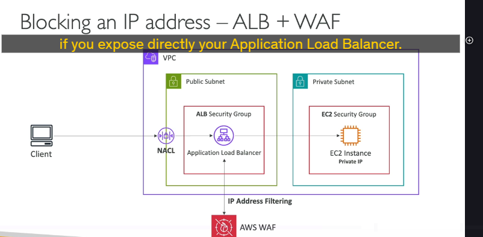
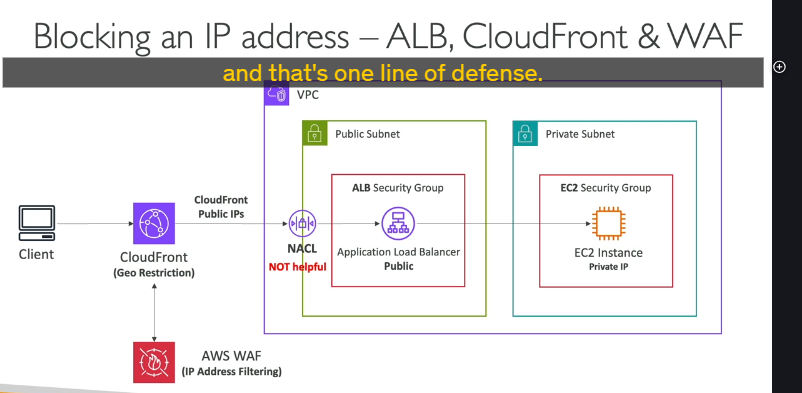

## Kịch bản 1: EC2 Instance "Trần Trụi" trong Public Subnet ☀️

Khi EC2 instance của bạn nằm trực tiếp trong public subnet và client truy cập thẳng vào nó:

1. **Network ACL (NACL) - Chốt chặn ngoài cổng Subnet:**

   - Đây là **tuyến phòng thủ đầu tiên** ở cấp độ subnet.
   - Bạn có thể tạo các rule `ALLOW` (cho phép) hoặc `DENY` (từ chối) một cách **tường minh** (explicit).
   - Rất đơn giản và hiệu quả để chặn IP ngay từ vòng ngoài.
   - _Ví dụ:_ Nếu NACL mặc định cho phép mọi thứ, traffic sẽ đi qua.

2. **Security Group (SG) - Vệ sĩ riêng của EC2:**

   - Tuyến phòng thủ thứ hai, gắn trực tiếp vào EC2 instance.
   - Security Group **chỉ có rule `ALLOW`**, không có rule `DENY`.
   - Nếu bạn biết trước IP của client, bạn có thể cấu hình SG chỉ cho phép duy nhất IP đó truy cập. Những IP khác không có trong rule `ALLOW` sẽ tự động bị chặn.

3. **Firewall Software trên EC2 (Tùy chọn):**

   - Nếu traffic "lọt" qua được NACL và SG, bạn vẫn có thể cài đặt một phần mềm firewall (ví dụ: `iptables` trên Linux, Windows Firewall) ngay trên OS của EC2 instance.
   - **Ưu điểm:** Kiểm soát rất chi tiết, tùy biến cao, không phụ thuộc AWS.
   - **Nhược điểm:** Sẽ tiêu tốn tài nguyên CPU của instance, có thể làm chậm instance.

---

## Kịch bản 2: Dùng Load Balancer (ALB/NLB) với EC2 "Ẩn mình" trong Private Subnet 🛡️

Đây là kiến trúc phổ biến và an toàn hơn:

- **Kiến trúc:** Client ➡️ Load Balancer (đặt trong public subnet) ➡️ EC2 instance (đặt trong private subnet).
- **Lợi ích:** EC2 instance của bạn nằm trong private subnet, không tiếp xúc trực tiếp với Internet, an toàn hơn nhiều.
- **Luồng hoạt động và Bảo mật:**

  1. **Security Group của EC2:** Sẽ được cấu hình để **chỉ cho phép traffic đến từ Load Balancer**.
  2. **Load Balancer (ALB/NLB):**
     - Thực hiện **"chấm dứt kết nối" (Connection Termination):** Client kết nối đến Load Balancer, sau đó Load Balancer sẽ thiết lập một kết nối mới đến EC2 instance.
     - Bạn có thể quản lý bảo mật ở cấp độ Load Balancer bằng **Security Group riêng của Load Balancer** hoặc các tính năng bảo mật khác của nó.
     - **Network ACL (NACL)** ở public subnet chứa Load Balancer vẫn có thể được sử dụng để tạo rule `ALLOW` hoặc `DENY` cho traffic đến Load Balancer.

  - _Lưu ý:_ Cơ chế bảo mật này áp dụng tương tự cho cả Application Load Balancer (ALB) và Network Load Balancer (NLB).

---

## Tăng cường "Giáp" cho Application Load Balancer (ALB) 💪

- Bạn có thể kết hợp ALB với **AWS WAF (Web Application Firewall)**.
- **WAF cho phép bạn:**
  - **Lọc địa chỉ IP** (IP address filtering) một cách linh hoạt.
  - Sử dụng nhiều bộ quy tắc mạnh mẽ khác để chống lại các kiểu tấn công web phổ biến (SQL injection, XSS,...).
- **Lưu ý:** Sử dụng WAF sẽ có chi phí, nhưng nó cung cấp khả năng kiểm soát và phòng thủ rất cao cấp cho ứng dụng của bạn nếu ALB là điểm tiếp xúc trực tiếp với Internet.

---

## Kịch bản 3: Sử dụng CloudFront (CDN) làm "Lá chắn" ngoài cùng 🌍

Khi bạn đặt CloudFront phía trước kiến trúc của mình:

- **Kiến trúc:** Client ➡️ CloudFront ➡️ Application Load Balancer (public subnet).
- **Luồng traffic:**
  - Client kết nối đến CloudFront.
  - CloudFront sẽ chuyển tiếp traffic từ các **Edge Location** của nó (với các địa chỉ IP public của CloudFront) đến Application Load Balancer của bạn.
- **Điểm cần đặc biệt lưu ý về Network ACL (NACL):**
  - NACL đặt ở public subnet của Application Load Balancer lúc này **KHÔNG còn hữu ích để lọc địa chỉ IP của client gốc nữa**.
  - Tại sao? Vì nguồn traffic trực tiếp đến ALB bây giờ là **CloudFront**, chứ không phải client. Tất cả traffic đều đến từ các IP của CloudFront.
- **Vậy bảo vệ thế nào?**
  1. **Security Group của ALB:** Phải được cấu hình để **chỉ cho phép traffic từ các dải IP public của CloudFront**.
  2. **Các lớp phòng thủ ở tầng CloudFront:**
     - **Geo Restriction:** Tính năng của CloudFront cho phép bạn chặn truy cập từ các quốc gia cụ thể (ví dụ, nếu bạn đang bị tấn công từ một quốc gia nào đó).
     - **AWS WAF trên CloudFront:** Đây là nơi hiệu quả để triển khai WAF. Bạn có thể lọc IP của client gốc, áp dụng các rule bảo vệ web ngay tại biên, trước khi traffic vào sâu hơn hệ thống của bạn.

---

## Lời khuyên "Vàng" 💡

Nếu bạn cảm thấy bối rối về việc áp dụng rule ở đâu, **hãy vẽ sơ đồ mạng ra**. Việc hình dung được luồng đi của traffic sẽ giúp bạn hiểu rõ tại sao việc áp dụng rule ở một tầng cụ thể lại có ý nghĩa (hoặc không có ý nghĩa).

---

## Chốt lại cho "Túi khôn" đi thi 📝

- Nắm vững các lớp phòng thủ: **NACL** (subnet level, explicit deny/allow), **Security Group** (instance/LB level, allow only), **Firewall Software** (OS level), **AWS WAF** (ALB/CloudFront level), **Geo Restriction** (CloudFront level).
- Hiểu rõ chúng hoạt động ở đâu và có tác dụng như thế nào trong các kiến trúc khác nhau (EC2 trực tiếp, qua Load Balancer, qua CloudFront).
- **Điểm cực kỳ quan trọng:** Khi có CloudFront, NACL ở tầng ALB sẽ không lọc được IP client gốc. Việc lọc IP client gốc lúc này nên được thực hiện ở CloudFront (ví dụ bằng WAF).
- **WAF** là một công cụ rất mạnh mẽ, có thể áp dụng ở cả ALB và CloudFront để tăng cường bảo mật.

Chào bạn! Chúng ta lại đến với một chủ đề ngày càng "hot" trên AWS và cũng thường xuyên xuất hiện trong các kỳ thi, đó là **High Performance Computing (HPC)** , hay còn gọi là **Tính toán hiệu năng cao** . Đừng lo lắng nếu nghe có vẻ "cao siêu", mình sẽ giúp bạn nắm bắt những ý chính một cách dễ hiểu nhất!

---

## HPC là gì và Tại sao Cloud lại là "Sân chơi" lý tưởng? 컴퓨팅 파워! 🚀

**High Performance Computing (HPC)** là việc sử dụng sức mạnh tính toán cực lớn để giải quyết các bài toán phức tạp, đòi hỏi xử lý một lượng khổng lồ dữ liệu và tính toán.

**Tại sao AWS lại tuyệt vời cho HPC?**

- **Khả năng mở rộng siêu tốc:** Bạn có thể tạo ra một số lượng rất lớn tài nguyên (máy chủ, lưu trữ) trong nháy mắt.
- **Tăng tốc độ ra kết quả:** Càng nhiều tài nguyên, bài toán càng được giải quyết nhanh hơn.
- **Chi trả theo những gì bạn dùng (Pay-as-you-go):** Tính toán xong, bạn có thể xóa toàn bộ hạ tầng và không phải trả thêm một xu nào. Quá tiện lợi đúng không?

**Ứng dụng của HPC ở đâu?** Rất nhiều lĩnh vực: phân tích gen (genomics), hóa học tính toán, mô hình hóa rủi ro tài chính, dự báo thời tiết, Machine Learning, Deep Learning, xe tự hành, v.v.

---

## "Bộ đồ nghề" AWS cho HPC 🛠️

Để xây dựng một hệ thống HPC trên AWS, chúng ta cần kết hợp nhiều dịch vụ và tính năng khác nhau. Hãy xem xét từng khía cạnh nhé:

### 1. Quản lý và Truyền tải Dữ liệu 🗄️➡️☁️

Lượng dữ liệu cho HPC thường rất lớn, nên việc đưa dữ liệu lên AWS hiệu quả là rất quan trọng.

- **AWS Direct Connect:**
  - Kết nối mạng riêng, an toàn, tốc độ cao (Gbps) giữa trung tâm dữ liệu của bạn và AWS.
- **AWS Snowball / Snowmobile:**
  - Khi bạn cần chuyển hàng Petabytes dữ liệu. Đây là giải pháp vật lý (gửi thiết bị đến chép dữ liệu rồi gửi lại AWS). Thường dùng cho các lần chuyển lớn, một lần.
- **AWS DataSync:**
  - Cài đặt agent để di chuyển lượng lớn dữ liệu giữa hệ thống on-premise (NAS, SMB) và các dịch vụ lưu trữ AWS như S3, EFS, FSx for Windows.

---

### 2. Sức mạnh Tính toán và Mạng lưới (Compute & Networking) 💻🔗

Đây là trái tim của HPC!

- **EC2 Instances:**
  - Chọn các loại instance tối ưu cho CPU (CPU optimized) hoặc GPU (GPU optimized) tùy thuộc vào loại tính toán.
  - Sử dụng **Spot Instances** hoặc **Spot Fleets** để tiết kiệm chi phí đáng kể.
  - **Auto Scaling** để tự động điều chỉnh số lượng instance theo nhu cầu tính toán.
  - **EC2 Placement Group (loại "Cluster"):** Đặt các instance trong cùng một "cluster" để có hiệu năng mạng tốt nhất (độ trễ thấp, băng thông cao, ví dụ 10 Gbps). Tất cả instance trong cluster placement group sẽ nằm trên cùng một rack, trong cùng một Availability Zone (AZ).
- **EC2 Enhanced Networking (SR-IOV) - Mạng Nâng cao:**
  - Cung cấp băng thông cao hơn, số gói tin mỗi giây (PPS - Packet Per Second) cao hơn, và độ trễ thấp hơn.
  - **Cách để có Enhanced Networking:**
    1. **ENA (Elastic Network Adapter):** Phổ biến và mới hơn. Hỗ trợ tốc độ mạng lên đến **100 Gbps** . Đây là cái bạn cần nhớ kỹ!
    2. **Intel 82599VF:** Công nghệ cũ hơn, hỗ trợ đến 10 Gbps. Ghi nhớ phòng khi gặp trong đề thi.
- **EFA (Elastic Fabric Adapter) - "Vũ khí tối thượng" cho Mạng HPC:**
  - Đây là một phiên bản **cải tiến của ENA, được thiết kế ĐẶC BIỆT cho HPC** .
  - **Chỉ hoạt động trên Linux.**
  - Tuyệt vời cho các tác vụ đòi hỏi **giao tiếp giữa các node (inter-node communication)** rất mạnh mẽ hoặc các **workload liên kết chặt chẽ (tightly coupled workload)** – nghĩ đến các bài toán tính toán phân tán.
  - **Tại sao nó "xịn"?** EFA sử dụng tiêu chuẩn **MPI (Message Passing Interface)** . Quan trọng hơn, nó **bỏ qua (bypass) nhân (kernel) của hệ điều hành Linux** để cung cấp độ trễ THẤP HƠN NỮA và truyền tải đáng tin cậy hơn.
  - **Thi cử:** Rất hay có câu hỏi phân biệt giữa ENA và EFA. Hãy đảm bảo bạn hiểu rõ sự khác biệt và khi nào dùng cái nào! EFA là cho HPC hiệu năng cao nhất, cần giao tiếp liên node mạnh.

---

### 3. Lưu trữ Dữ liệu (Storage) 💾

Dữ liệu HPC cần được truy cập nhanh và hiệu quả.

- **Lưu trữ gắn liền với Instance (Instance-Attached Storage):**
  - **EBS (Elastic Block Store):** Có thể đạt tới 256,000 IOPS với `io2 Block Express`.
  - **Instance Store:** Hiệu năng cực cao (hàng triệu IOPS), độ trễ rất thấp vì nằm trên phần cứng của EC2 instance. Tuy nhiên, dữ liệu sẽ mất nếu instance bị dừng hoặc chấm dứt (ephemeral).
- **Lưu trữ Mạng (Network Storage):**
  - **Amazon S3:** Lưu trữ các đối tượng lớn (large objects). Đây không phải là file system truyền thống.
  - **EFS (Elastic File System):** IOPS có thể tự động mở rộng theo kích thước tổng của file system, hoặc bạn có thể dùng chế độ Provisioned IOPS để có IOPS cao hơn.
  - **FSx for Lustre - "Ngôi sao" Lưu trữ cho HPC:** 🌟
    - Đây là một hệ thống tệp được **tối ưu hóa đặc biệt cho HPC** . (Lustre = Linux + Cluster).
    - Cung cấp hàng triệu IOPS.
    - Dữ liệu ở backend được lưu trữ trên S3. Rất quan trọng phải nhớ dịch vụ này cho HPC!

---

### 4. Tự động hóa và Điều phối (Automation & Orchestration) 🤖⚙️

Quản lý một cụm HPC lớn cần công cụ hỗ trợ.

- **AWS Batch:**
  - Dịch vụ hỗ trợ chạy các **job song song trên nhiều node (multi-node parallel jobs)** .
  - Giúp bạn lên lịch và khởi chạy các EC2 instance cho các batch job một cách dễ dàng. AWS Batch sẽ quản lý các instance này. Rất phổ biến cho HPC.
- **AWS ParallelCluster:**
  - Một công cụ quản lý cụm (cluster) mã nguồn mở, giúp bạn **triển khai các cụm HPC trên AWS một cách dễ dàng** .
  - Bạn cấu hình cụm thông qua các tệp văn bản (text files).
  - Nó tự động hóa việc tạo VPC, Subnet, các loại cluster và instance.
  - **Lưu ý cho kỳ thi:** Thường được đề cập là sử dụng **ParallelCluster cùng với EFA** . Trong file cấu hình của ParallelCluster có tham số để bật EFA, giúp cải thiện hiệu năng mạng và do đó, tăng hiệu năng của cụm HPC.

---

## Chốt lại "Bí kíp" HPC cho Kỳ thi 🎯

- HPC trên AWS **không phải là một dịch vụ đơn lẻ** , mà là sự **kết hợp của nhiều dịch vụ và tùy chọn khác nhau** .
- Hãy nắm vững các thành phần chính trong mỗi "trụ cột":
  - **Truyền tải dữ liệu:** Direct Connect, Snowball, DataSync.
  - **Tính toán & Mạng:** EC2 (optimized, Spot), Placement Group (Cluster), **ENA** (chung chung, tốc độ cao), **EFA** (chuyên cho HPC, MPI, OS bypass, Linux).
  - **Lưu trữ:** EBS, Instance Store, S3, EFS, và đặc biệt là **FSx for Lustre** (HPC optimized).
  - **Tự động hóa & Điều phối:** **AWS Batch** , **AWS ParallelCluster** (thường đi với EFA).
- Hiểu _tại sao_ một dịch vụ/tính năng lại phù hợp với HPC (ví dụ: EFA cho mạng độ trễ cực thấp, FSx for Lustre cho lưu trữ chia sẻ hiệu năng cao).

Hy vọng bài giảng này đã giúp bạn "giải mã" được HPC trên AWS một cách tường tận. Đây là một mảng kiến thức rộng nhưng rất thú vị và có tính ứng dụng cao. Nếu có bất kỳ câu hỏi nào, đừng ngần ngại hỏi mình nhé! Chúc bạn ôn tập thật tốt!

Hy vọng phần tóm tắt này giúp bạn hệ thống hóa kiến thức một cách mạch lạc. Đây là những khái niệm cốt lõi trong việc thiết kế mạng an toàn trên AWS. Cần đào sâu thêm điểm nào, cứ nói mình nhé!
