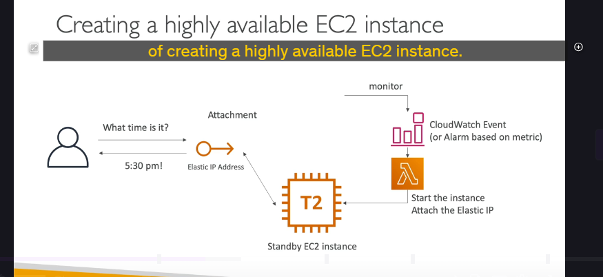
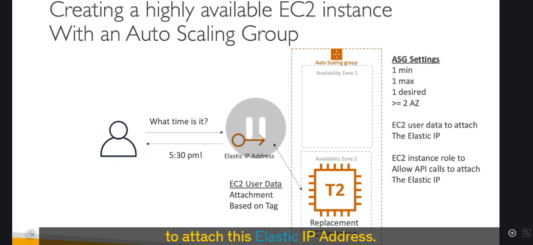
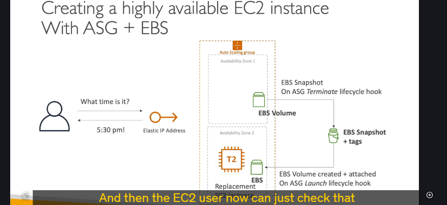

làm thế nào để một **EC2 instance** đơn lẻ trở nên có **Tính sẵn sàng cao (Highly Available - HA)**. Mặc định thì một EC2 instance chỉ chạy trong một Availability Zone (AZ) thôi, nên nếu AZ đó có vấn đề là "toang". Nhưng đừng lo, chúng ta có thể "chế biến" để nó "bất tử" hơn!

---

## Tại sao cần làm cho EC2 Highly Available? 🤔

Một EC2 instance đơn lẻ, nếu gặp sự cố (phần cứng hỏng, AZ gặp vấn đề), ứng dụng của bạn sẽ "sập". Mục tiêu của chúng ta là thiết kế sao cho dù có sự cố, vẫn có một instance khác đứng lên thay thế, đảm bảo ứng dụng tiếp tục phục vụ người dùng.

---

## Cách 1: Dùng Standby EC2, Elastic IP và "Phép thuật" Lambda ✨

Đây là một cách khá "thủ công" nhưng hiệu quả:

- **Thiết lập ban đầu:**

  - Bạn có một **EC2 instance chính (Primary)** đang chạy web server, được gắn một địa chỉ **Elastic IP** (IP tĩnh). Người dùng truy cập web server qua Elastic IP này.
  - Bạn có một **EC2 instance dự phòng (Standby)**, có thể đang chạy hoặc đang tắt.

- **Phát hiện sự cố:**

  - Dùng **CloudWatch Alarm** (ví dụ: theo dõi CPU lên 100%, instance không phản hồi) hoặc **CloudWatch Event** (ví dụ: sự kiện instance bị terminate).

- **Quá trình Chuyển đổi dự phòng (Failover):**
  1.  Khi CloudWatch Alarm/Event được kích hoạt, nó sẽ gọi một **Lambda function**.
  2.  Lambda function này sẽ:
      - Khởi động instance Standby (nếu nó chưa chạy).
      - Thực hiện API call để **gỡ Elastic IP khỏi instance Primary** và **gắn Elastic IP đó vào instance Standby**. (Một Elastic IP chỉ có thể gắn vào một instance tại một thời điểm).
  3.  Instance Primary sau đó có thể bị terminate hoặc biến mất.
- **Ưu điểm:** Người dùng không cảm nhận được sự gián đoạn nhiều vì họ vẫn truy cập qua cùng một địa chỉ Elastic IP.

---

## Cách 2: Dùng Auto Scaling Group (ASG) - Chế độ "Một mình một ngựa" 🏇

Cách này thông minh hơn, tận dụng sức mạnh của Auto Scaling Group (ASG):

- **Thiết lập ASG:**

  - Cấu hình ASG với:
    - Số lượng instance tối thiểu (Minimum): **1**
    - Số lượng instance tối đa (Maximum): **1**
    - Số lượng instance mong muốn (Desired): **1**
  - Chỉ định ASG hoạt động trên **nhiều Availability Zone** (ví dụ: 2 AZ).
  - => Với cấu hình này, ASG sẽ luôn đảm bảo **CHỈ CÓ MỘT** EC2 instance chạy tại một thời điểm.

- **Gắn Elastic IP:**

  - Người dùng vẫn truy cập qua một Elastic IP cố định.
  - Trong **EC2 User Data script** (script chạy khi instance khởi động) của instance, bạn sẽ viết mã để instance đó **tự động thực hiện API call để gắn Elastic IP** vào chính nó (ví dụ, dựa trên Tags của Elastic IP).

- **Quá trình Chuyển đổi dự phòng (Failover):**
  1.  Nếu instance hiện tại (ví dụ, ở AZ1) bị terminate hoặc gặp sự cố.
  2.  ASG sẽ tự động phát hiện điều này và **khởi chạy một instance thay thế** trong một AZ khác (ví dụ, AZ2) để duy trì số lượng mong muốn là 1.
  3.  Instance mới này khi khởi động sẽ chạy User Data script và **tự động gắn lại Elastic IP** vào nó.
- **Ưu điểm:**
  - **Tự động hoàn toàn** bởi ASG, không cần CloudWatch Alarm hay Lambda function riêng để xử lý logic failover cơ bản này.
- **Yêu cầu:** EC2 instance cần có một **Instance Role** (IAM Role) cho phép nó thực hiện API call để gắn Elastic IP.

---

## Cách 3: ASG cho EC2 "Có trạng thái" (Stateful) với EBS Volume và Lifecycle Hooks 🔄💾

Cách này phức tạp hơn, dành cho trường hợp EC2 instance của bạn cần lưu trữ dữ liệu lâu dài trên một EBS Volume (ví dụ: một database). Nhớ rằng EBS Volume bị khóa vào một AZ cụ thể.

- **Thiết lập cơ bản:** Tương tự Cách 2 (ASG min/max/desired=1, Elastic IP, Instance Role). Điểm khác biệt là instance này có một **EBS Volume** quan trọng gắn vào.

- **Quá trình Chuyển đổi dự phòng (Failover) - Kết hợp nhiều tuyệt kỹ:**

  1.  **Khi instance chính (ở AZ1) bắt đầu bị terminate:**
      - Một **ASG Lifecycle Hook** cho sự kiện "Terminating" được kích hoạt.
      - Hook này có thể gọi một script (ví dụ: Lambda) để **tạo một EBS Snapshot** từ EBS Volume của instance đang bị terminate ở AZ1. (Khi instance đang trong quá trình terminate và được hook giữ lại, EBS volume có thể được snapshot). Snapshot này được gắn tag cẩn thận.
  2.  **ASG khởi chạy instance thay thế (ở AZ2):**
      - Một **ASG Lifecycle Hook** khác cho sự kiện "Launching" được kích hoạt khi instance mới ở AZ2 bắt đầu khởi chạy.
      - Hook này gọi một script để:
        - **Tạo một EBS Volume mới từ EBS Snapshot** đã tạo ở bước trên, đảm bảo volume mới này được tạo trong AZ2.
        - **Gắn EBS Volume mới này vào instance thay thế** đang khởi chạy.
  3.  **EC2 User Data trên instance mới:**
      - Sau khi instance khởi chạy và EBS volume được gắn (nhờ lifecycle hook), User Data script sẽ chạy.
      - Script này kiểm tra việc gắn EBS volume và sau đó **gắn Elastic IP** vào instance mới.

- **Kết quả:** Bạn đã làm cho một EC2 instance "có trạng thái" (với dữ liệu trên EBS) trở nên highly available qua các AZ. Cách này kết hợp sức mạnh của EC2 User Data và ASG Lifecycle Hooks.

---

## Chốt lại "Bài học" quan trọng 💡

- AWS cung cấp nhiều cách để bạn "hô biến" một EC2 instance đơn lẻ thành một giải pháp có tính sẵn sàng cao.
- Lựa chọn phương pháp nào phụ thuộc vào **yêu cầu cụ thể** của bạn (stateless hay stateful, mức độ tự động hóa mong muốn, độ phức tạp chấp nhận được).
- **Elastic IP** là chìa khóa để người dùng có một điểm truy cập cố định.
- **CloudWatch Alarms/Events + Lambda** phù hợp cho các kịch bản failover tùy chỉnh.
- **Auto Scaling Group (ASG)** với cấu hình min/max/desired=1 là một cách mạnh mẽ để tự động thay thế instance hỏng.
  - **EC2 User Data** giúp instance tự cấu hình khi khởi động (ví dụ: gắn Elastic IP).
  - **ASG Lifecycle Hooks** cho phép bạn thực hiện các hành động tùy chỉnh trong quá trình instance được khởi chạy hoặc chấm dứt (ví dụ: snapshot và restore EBS volume).
- Việc này đòi hỏi bạn phải thiết kế và tự động hóa nhiều hơn, nhưng kết quả mang lại là một hệ thống vững vàng hơn.

Hiểu rõ các cơ chế này sẽ giúp bạn tự tin hơn rất nhiều khi thiết kế các giải pháp HA trên AWS.
