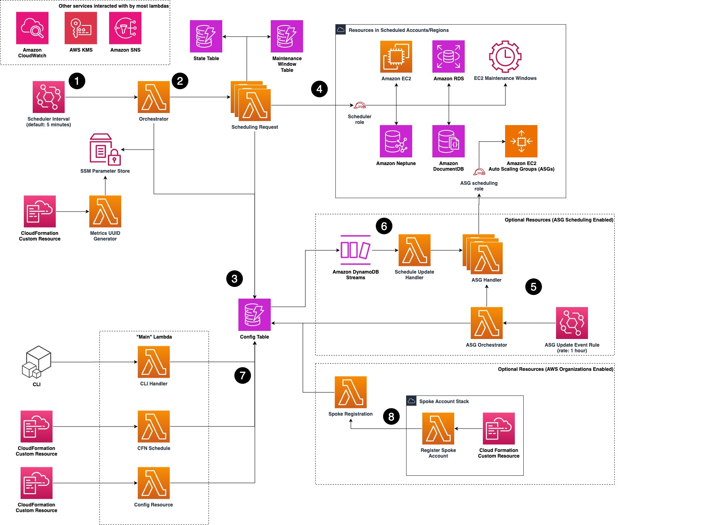

## AWS Instance Scheduler là gì? ⏰💰

Đây là một điểm quan trọng cần nhớ: Instance Scheduler **không phải là một dịch vụ (service)** riêng lẻ của AWS. Thay vào đó, nó là một **Giải pháp của AWS (AWS Solution)** được triển khai hoàn toàn thông qua một template **CloudFormation**.

**Mục đích chính của nó là:** Tự động **start (khởi động)** và **stop (dừng)** các dịch vụ AWS của bạn (như EC2 và RDS) theo một lịch trình định sẵn để **giảm chi phí**, có thể lên tới 70%.

* **Ví dụ điển hình:** Tự động tắt tất cả các EC2 instance của công ty sau giờ làm việc và khởi động lại chúng vào buổi sáng hôm sau.

---
## Cách hoạt động (Kiến trúc bên trong) 🤖

Mặc dù kiến trúc đầy đủ có vẻ phức tạp, nhưng bạn chỉ cần hiểu ý tưởng cốt lõi:

1.  **Lịch trình được lưu trong DynamoDB:** Toàn bộ lịch trình (ví dụ: "giờ hành chính", "chỉ chạy cuối tuần",...) được định nghĩa và lưu trữ trong một bảng **DynamoDB**.
2.  **Lambda thực thi công việc:**
    * Một **Lambda function** chính sẽ được kích hoạt định kỳ (ví dụ: mỗi 5 phút).
    * Nó sẽ đọc lịch trình từ bảng DynamoDB để xem có instance nào cần start hay stop hay không.
    * Sau đó, nó sẽ kích hoạt các Lambda function khác để thực hiện hành động start/stop cụ thể trên các instance đó.

---
## Các tính năng chính và dịch vụ được hỗ trợ ✅

* **Tiết kiệm chi phí:** Đây là lợi ích lớn nhất.
* **Các dịch vụ được hỗ trợ chính:**
    * **Amazon EC2**
    * **EC2 Auto Scaling Groups**
    * **Amazon RDS** (bao gồm cả RDS Clusters)
* **Linh hoạt:** Hỗ trợ các tài nguyên nằm ở nhiều tài khoản khác nhau (**cross-account**) và nhiều khu vực khác nhau (**cross-region**).
* **Sẵn sàng cho Production:** Đây là một giải pháp hoàn chỉnh và đã được kiểm chứng bởi AWS.

---
## Triển khai và Cấu hình 🚀

* Toàn bộ giải pháp được triển khai bằng cách chạy một stack **CloudFormation**.
* Sau khi triển khai, bạn sẽ quản lý và tùy chỉnh các lịch trình bằng cách **chỉnh sửa các item trong bảng DynamoDB** đã được tạo ra.

---
## "Chốt hạ" cho Kỳ thi 📝

* **AWS Instance Scheduler** là một **giải pháp (Solution)**, không phải là một dịch vụ (Service).
* Nó được triển khai thông qua **CloudFormation**.
* Mục tiêu chính là **tiết kiệm chi phí** bằng cách tự động **start/stop** các tài nguyên, chủ yếu là **EC2** và **RDS**.
* Kiến trúc cốt lõi dựa trên việc sử dụng **DynamoDB** để lưu trữ lịch trình và **Lambda** để thực thi các hành động.

