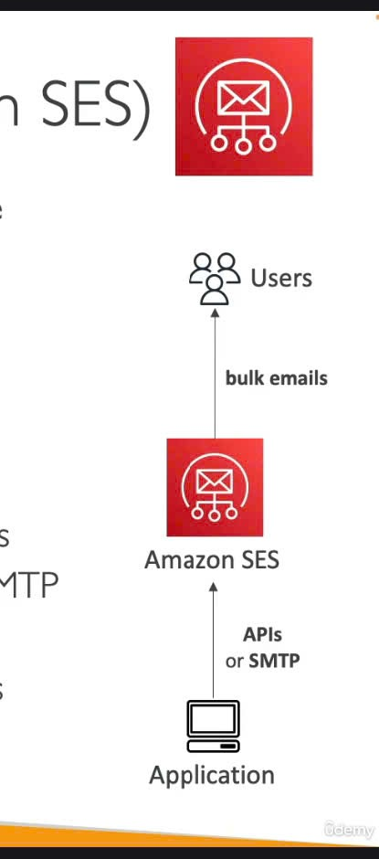

📧
Amazon SES là gì?
Amazon SES là một dịch vụ được quản lý hoàn toàn (fully managed), cho phép bạn gửi email một cách an toàn, trên toàn cầu và ở quy mô lớn.
Nói nôm na, khi ứng dụng của bạn cần gửi email (dù ít hay nhiều), SES sẽ là "bưu điện" chuyên nghiệp giúp bạn làm việc đó.

Cách SES hoạt động (Tổng quan) 📬

- Ứng dụng của bạn (ví dụ: web app, mobile app) sẽ sử dụng API của SES hoặc kết nối qua máy chủ SMTP của SES.
- Amazon SES sau đó sẽ thay mặt bạn gửi các email (kể cả email hàng loạt - bulk emails) đến người dùng.
  Những tính năng "Sáng giá" của SES ✨
- Gửi và Nhận Email (Outbound & Inbound): Không chỉ gửi đi, SES còn có thể giúp bạn nhận email phản hồi.
- Bảng điều khiển Uy tín (Reputation Dashboard): Cực kỳ quan trọng!
  - Theo dõi xem email của bạn có được mở hay không.
  - Cung cấp thông tin chi tiết về hiệu suất gửi mail.
  - Phản hồi về chống thư rác (anti-spam feedback): biết được người dùng có đánh dấu email của bạn là spam hay không.
- Thống kê Email:
  - Số lượng email được gửi thành công (deliveries).
  - Số lượng email bị trả lại (bounces).
  - Kết quả từ vòng lặp phản hồi (feedback loop results).
  - Tỷ lệ email được mở.
- Chuẩn Bảo mật Email: Hỗ trợ các tiêu chuẩn bảo mật email phổ biến hiện nay như DKIM (DomainKeys Identified Mail) và SPF (Sender Policy Framework) để tăng độ tin cậy cho email của bạn.
- Triển khai IP Linh hoạt:
  - Shared IP (IP dùng chung): Tiết kiệm chi phí.
  - Dedicated IP (IP riêng): Kiểm soát uy tín IP tốt hơn.
  - Customer-owned IP (IP của riêng bạn): Mang IP của bạn lên SES.
- Cách thức Truy cập: Bạn có thể tương tác với SES qua AWS Management Console, AWS APIs, hoặc giao thức SMTP.
  Dùng Amazon SES cho việc gì? 🎯
- Email Giao dịch (Transactional Emails): Email tự động như xác nhận đơn hàng, đặt lại mật khẩu, thông báo tài khoản.
- Email Tiếp thị (Marketing Emails): Gửi các chiến dịch quảng cáo, bản tin.
- Truyền thông Email Hàng loạt (Bulk Email Communications): Gửi thông báo cho một lượng lớn người dùng.
  "Mẹo" cho Kỳ thi 📝
  Khi nhắc đến Amazon SES, hãy nhớ:
- Đây là dịch vụ chuyên để gửi và nhận email ở quy mô lớn.
- Các tính năng cốt lõi: quản lý uy tín người gửi, thống kê chi tiết, bảo mật với DKIM/SPF, tùy chọn IP linh hoạt.
- Các trường hợp sử dụng phổ biến: email giao dịch, email marketing, và gửi email hàng loạt.
