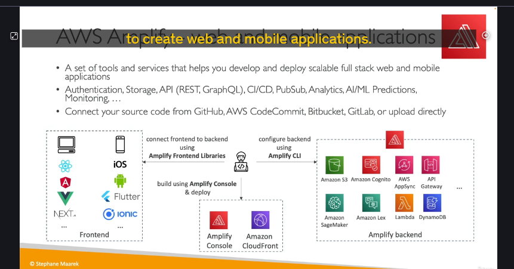

## AWS Amplify là gì? 📱🚀

Về cốt lõi, bạn hãy nghĩ về **AWS Amplify** như một **bộ công cụ phát triển ứng dụng web và di động**.

Nó giống như một "cửa hàng tiện lợi" (one-stop shop) mà AWS tạo ra, giúp bạn tích hợp rất nhiều dịch vụ backend của AWS vào một nơi duy nhất để xây dựng ứng dụng của mình một cách nhanh chóng.

Một cách ví von dễ hiểu: **Amplify giống như là "Elastic Beanstalk cho ứng dụng web và di động"**.

---
## Luồng làm việc với Amplify (Từ Backend đến Frontend) 🔧

Quá trình phát triển với Amplify thường đi qua 3 bước chính:

1.  **Tạo Backend (Sử dụng Amplify CLI):**
    * Developer sẽ dùng dòng lệnh của Amplify (**Amplify CLI**) để định nghĩa và tạo ra "Amplify Backend".
    * "Phía sau cánh gà", Amplify sẽ tự động sử dụng và cấu hình rất nhiều dịch vụ AWS quen thuộc mà chúng ta đã học:
        * **Amazon Cognito** cho xác thực người dùng (Authentication).
        * **Amazon S3** để lưu trữ dữ liệu (Storage).
        * **AppSync** (cho GraphQL API) và **API Gateway** (cho REST API).
        * **Lambda** để chạy các hàm xử lý logic (Functions).
        * **DynamoDB** để lưu trữ dữ liệu (Data).
        * Cùng nhiều dịch vụ khác cho AI/ML, Analytics, PubSub...

2.  **Kết nối Frontend (Sử dụng Amplify Libraries):**
    * Sau khi có backend, bạn sẽ thêm các thư viện frontend của Amplify (**Amplify Frontend Libraries**) vào ứng dụng web hoặc di động của mình.
    * Các thư viện này giúp cho code frontend của bạn dễ dàng "gọi" và tương tác với các tài nguyên backend đã được tạo ở bước 1.

3.  **Triển khai (Sử dụng Amplify Console):**
    * Khi ứng dụng đã sẵn sàng, bạn sẽ sử dụng **Amplify Console** để triển khai.
    * Amplify Console sẽ lo việc build, host và phân phối ứng dụng của bạn ra toàn cầu thông qua **Amazon CloudFront**.

---
## "Chốt hạ" cho Kỳ thi 📝

* **AWS Amplify** là một bộ công cụ (toolchain) dành cho developer, giúp đơn giản hóa và tăng tốc quá trình xây dựng **ứng dụng web và di động full-stack** trên AWS.
* Nó đóng gói và tích hợp nhiều dịch vụ AWS phức tạp (như Cognito, AppSync, S3, Lambda...) vào một quy trình làm việc thống nhất.
* Hãy nhớ 3 thành phần chính:
    * **Amplify CLI:** Dùng để tạo và quản lý backend.
    * **Amplify Libraries:** Dùng để tích hợp frontend với backend.
    * **Amplify Console:** Dùng để build, triển khai và host ứng dụng.

