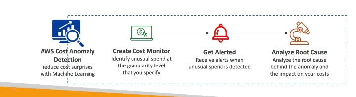

# AWS Cost Anomaly Detection – “Chuyên gia bắt gian lận chi phí” 😉

## AWS Cost Anomaly Detection là gì? 🕵️‍♂️💸

AWS Cost Anomaly Detection là dịch vụ liên tục theo dõi dữ liệu chi phí và sử dụng của bạn.
Điểm đặc biệt là nó sử dụng **Machine Learning (Học máy)** để phát hiện các khoản chi tiêu bất thường (_unusual spends_).

-------------

## "Thám tử" này làm việc ra sao? 🤖

- **Tự học hỏi**: Dịch vụ này sẽ "học" từ các kiểu chi tiêu lịch sử độc nhất của bạn.
- **Phát hiện "biến"**: Sau khi đã "hiểu" bạn, nó có thể nhận ra:
  - Các đợt **tăng chi phí đột biến một lần** (_one-time cost spikes_).
  - Các trường hợp **chi phí tăng liên tục** (_continuous cost increases_) mà không bình thường.
- **Không cần "chỉ bài"**: Bạn **không cần tự định nghĩa ngưỡng (thresholds)** nào cả.
  → Dịch vụ sẽ tự nhận biết điều gì "trông hơi lạ". Quá xịn!

---

## "Thám tử" theo dõi những gì? 🔎

- Các **dịch vụ AWS** bạn đang dùng.
- Các **tài khoản thành viên** (_member accounts_) trong AWS Organization của bạn.
- Các **thẻ phân bổ chi phí** (_cost allocation tags_).
- Các **danh mục chi phí** (_cost categories_).

---

## Báo cáo và Cảnh báo 📢

Khi phát hiện điều gì đó bất thường:

- Dịch vụ sẽ gửi cho bạn **báo cáo phát hiện bất thường** (_anomaly detection report_).
- Báo cáo bao gồm **phân tích nguyên nhân gốc rễ** (_root cause analysis_).
- Cách nhận thông báo:
  - **Cảnh báo riêng lẻ** (_individual alerts_).
  - Hoặc **tóm tắt hàng ngày/hàng tuần** (_daily or weekly summary_) thông qua **Amazon SNS**.

---

## Tóm lại "Sức mạnh" 💪

Sử dụng Machine Learning, AWS Cost Anomaly Detection giúp bạn:

- **Theo dõi chi phí tự động**.
- **Nhận cảnh báo khi có bất thường**.
- **Nhanh chóng phân tích nguyên nhân gốc rễ**.

---

## "Bỏ túi" cho Kỳ thi 📝

- **AWS Cost Anomaly Detection**: Dùng Machine Learning để **phát hiện chi tiêu bất thường**.
- **Không cần cấu hình ngưỡng thủ công**.
- **Cung cấp báo cáo và cảnh báo tự động** (thường qua SNS).
- **Mục tiêu**: Giúp phát hiện sớm các vấn đề về chi phí không mong muốn.

---

Một công cụ rất hữu ích để giữ cho **“ví tiền” AWS** của bạn luôn trong tầm kiểm soát.
**Chúc bạn một ngày học tập hiệu quả!** 👍
