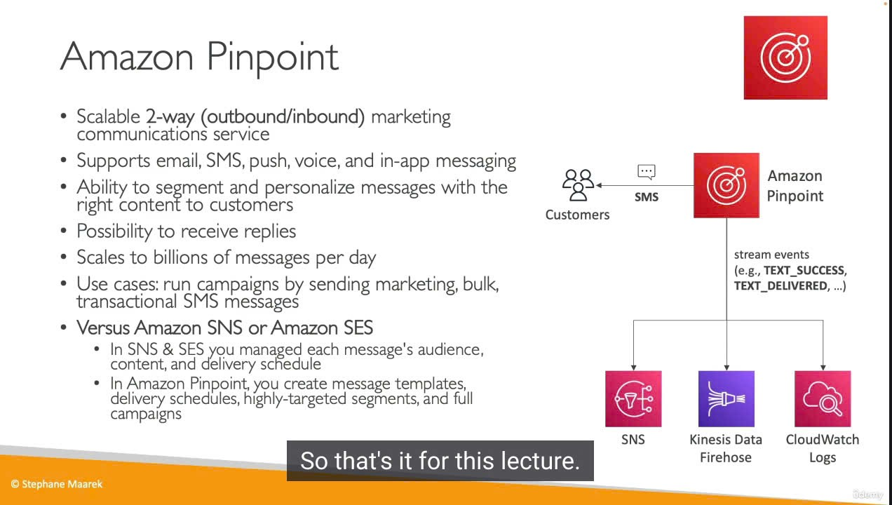

Amazon Pinpoint là gì mà "đa năng" vậy? 🎯
Amazon Pinpoint là một dịch vụ truyền thông marketing hai chiều (inbound và outbound) có khả năng mở rộng, được thiết kế để giúp bạn tương tác với khách hàng.

- "Vũ khí" đa kênh: Pinpoint cho phép bạn gửi thông điệp qua nhiều kênh khác nhau:
  - Email 📧
  - SMS (Tin nhắn văn bản) 📱
  - Push Notifications (Thông báo đẩy trên di động) 📲
  - Voice (Tin nhắn thoại) 🗣️
  - In-app Messaging (Tin nhắn ngay trong ứng dụng của bạn) 💬
- Trọng tâm: Một trong những trường hợp sử dụng chính và mạnh mẽ của Pinpoint là gửi SMS.
  Những khả năng "Thượng thừa" của Pinpoint 🌟
- Gửi thông điệp đa kênh: Như đã nói, bạn có thể tiếp cận khách hàng qua email, SMS, push, voice, và tin nhắn trong ứng dụng.
- Phân khúc và Cá nhân hóa Khách hàng (Segmentation & Personalization): Đây là điểm rất mạnh!
  - Tạo Nhóm Khách hàng (Segments): Bạn có thể chia khách hàng của mình thành các nhóm nhỏ dựa trên hành vi, thuộc tính, hoặc các tiêu chí khác. Ví dụ: nhóm khách hàng mới đăng ký, nhóm khách hàng mua nhiều, nhóm khách hàng không hoạt động...
  - Cá nhân hóa Nội dung: Gửi những thông điệp với nội dung được "đo ni đóng giày" cho từng phân khúc khách hàng cụ thể, giúp tăng tính liên quan và hiệu quả.
- Tiếp nhận Phản hồi (Receive Replies): Hỗ trợ giao tiếp hai chiều. Khách hàng có thể trả lời tin nhắn SMS của bạn, và bạn có thể xử lý những phản hồi đó.
- Khả năng Mở rộng "Khủng" (Scalability): Pinpoint có thể xử lý hàng tỷ tin nhắn mỗi ngày.
  Dùng Pinpoint cho những việc gì? (Use Cases) 🚀
- Chạy các Chiến dịch Marketing (Campaigns):
  - Gửi email marketing hàng loạt đến các phân khúc khách hàng đã định.
  - Thiết kế các hành trình khách hàng (customer journeys) tự động.
- Gửi Tin nhắn SMS Giao dịch (Transactional SMS):
  - Ví dụ: gửi mã OTP, xác nhận đơn hàng, thông báo giao hàng qua SMS.
    Xử lý Sự kiện và Tự động hóa với Pinpoint 📈🤖
    Khi bạn gửi tin nhắn qua Pinpoint, các sự kiện liên quan sẽ được ghi nhận và có thể được chuyển tiếp đến các dịch vụ AWS khác để bạn xử lý hoặc phân tích sâu hơn:
- Các loại sự kiện: tin nhắn gửi thành công (text success), tin nhắn đã được giao (text delivered), phản hồi của khách hàng (replies), v.v.
- Đích đến của sự kiện:
  - Amazon SNS (Simple Notification Service): Để kích hoạt các hành động khác.
  - Amazon Kinesis Data Firehose: Để đưa dữ liệu sự kiện vào các kho lưu trữ như S3, Redshift cho việc phân tích.
  - Amazon CloudWatch Logs: Để lưu trữ và theo dõi logs.
- Lợi ích: Khả năng này cho phép bạn xây dựng các quy trình tự động hóa phức tạp dựa trên kết quả tương tác của Pinpoint với khách hàng.

Pinpoint vs. SNS vs. SES: Ai "Pro" hơn trong việc gì? 🤔
Đây là câu hỏi rất hay và quan trọng để bạn hiểu rõ vị trí của Pinpoint!

- Với Amazon SNS (Simple Notification Service) hoặc Amazon SES (Simple Email Service):
  - Bạn (hoặc ứng dụng của bạn) phải tự quản lý nhiều thứ:
    - Đối tượng nhận tin nhắn (audience).
    - Nội dung cụ thể cho từng người (content).
    - Lịch trình gửi tin (delivery schedule).
  - Điều này có thể tốn rất nhiều công sức và khó mở rộng nếu bạn muốn làm các chiến dịch marketing phức tạp, nhắm mục tiêu chi tiết.
- Với Amazon Pinpoint:
  - Pinpoint sẽ quản lý giúp bạn những phần phức tạp đó!
  - Bạn tập trung vào việc:
    - Tạo các mẫu tin nhắn (message templates).
    - Thiết lập lịch trình gửi (delivery schedules).
    - Xây dựng các phân khúc khách hàng siêu mục tiêu (highly targeted segments).
    - Thiết kế và quản lý toàn bộ chiến dịch (full campaigns).
  - Tất cả những điều này được quản lý bởi dịch vụ Pinpoint.
    Kết luận dễ hiểu: Hãy xem Pinpoint như là một "phiên bản tiến hóa" của SNS và SES, đặc biệt khi bạn muốn thực hiện các chiến dịch truyền thông marketing toàn diện và chuyên nghiệp. Nó không chỉ là gửi tin nhắn, mà còn là quản lý, phân tích, và tối ưu hóa toàn bộ quá trình tương tác với khách hàng.
    "Mẹo" cho Kỳ thi 📝
- Amazon Pinpoint: Dịch vụ cho truyền thông marketing đa kênh (email, SMS, push, voice, in-app).
- Tính năng nổi bật: Phân khúc khách hàng (segmentation), cá nhân hóa (personalization), quản lý chiến dịch (campaign management), theo dõi sự kiện.
- Phân biệt rõ:
  - SNS: Gửi thông báo chung chung, kích hoạt hệ thống.
  - SES: Chuyên gửi email (giao dịch, marketing) số lượng lớn, tập trung vào khả năng gửi và uy tín.
  - Pinpoint: Giải pháp marketing toàn diện hơn, quản lý cả hành trình khách hàng, phân khúc, và nhiều kênh.
