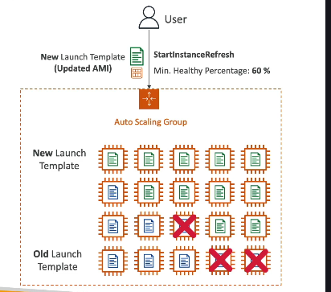

# AWS Auto Scaling Group: Instance Refresh – Giải Thích Chi Tiết

## 1. Instance Refresh là gì?



**Instance Refresh** là một tính năng rất hữu ích của **Auto Scaling Group (ASG)** trên AWS, cho phép bạn cập nhật toàn bộ nhóm EC2 instance một cách tự động khi có sự thay đổi về cấu hình, đặc biệt là khi bạn có **launch template** hoặc **launch configuration** mới (ví dụ: cập nhật AMI, thông số instance, v.v).

---

## 2. Tại sao cần Instance Refresh?

- Khi bạn thay đổi **AMI** (Amazon Machine Image) hoặc cập nhật launch template (ví dụ: vá bảo mật, update OS,...), bạn muốn tất cả các EC2 instance trong ASG đều chạy phiên bản mới này.
- Thay vì phải thủ công terminate từng instance, hoặc chờ instance cũ chết rồi instance mới lên, **Instance Refresh** giúp bạn tự động hóa quá trình này.

---

## 3. Cách hoạt động của Instance Refresh

### **Quy trình:**

1. **Khởi tạo Instance Refresh** (thường qua API, Console, hoặc CLI).
2. **Chỉ định launch template/version** mới cho ASG.
3. ASG sẽ bắt đầu quá trình terminate dần dần các instance cũ và thay thế bằng instance mới theo cấu hình mới.
4. **Minimum healthy percentage**: Bạn có thể cài đặt % tối thiểu instance "healthy" cần giữ lại trong quá trình refresh (ví dụ: 60%). Điều này đảm bảo luôn có đủ instance phục vụ user.
5. **Warm-up time**: Định nghĩa thời gian chờ để instance mới được coi là "sẵn sàng" (ready/healthy) trước khi tiếp tục refresh các instance tiếp theo.

### **Ví dụ:**

- Bạn có ASG với 10 instance, launch từ AMI cũ.
- Bạn tạo launch template mới với AMI mới.
- Bạn khởi động Instance Refresh, đặt **minimum healthy percentage = 60%**.
- ASG sẽ đảm bảo luôn có ít nhất 6 instance healthy, từng bước terminate và thay thế 4 instance còn lại bằng instance mới theo template mới.
- Sau khi các instance mới đã "warm-up" xong, ASG tiếp tục refresh các instance còn lại cho đến khi tất cả đều dùng AMI mới.

---

## 4. Ưu điểm của Instance Refresh

- **Tự động, an toàn, giảm downtime**: Đảm bảo luôn có số lượng instance healthy phục vụ user.
- **Kiểm soát tốc độ cập nhật**: Nhờ thiết lập minimum healthy percentage và warm-up time.
- **Không cần viết script/automation phức tạp**: AWS xử lý hoàn toàn tự động.

---

## 5. Cách kích hoạt Instance Refresh

- **AWS Console**: Vào Auto Scaling Group → Instance Refresh → Start instance refresh.
- **AWS CLI**:
  ```sh
  aws autoscaling start-instance-refresh --auto-scaling-group-name <ASG_NAME> --preferences '{"MinHealthyPercentage":60,"InstanceWarmup":300}'
  ```
- **API/SDK**: Sử dụng lệnh `StartInstanceRefresh`.

---

## 6. Tóm tắt

- Instance Refresh giúp cập nhật toàn bộ EC2 instances trong Auto Scaling Group sang cấu hình mới một cách tự động, an toàn và tối ưu.
- Bạn chỉ cần update launch template và khởi động Instance Refresh, phần còn lại AWS sẽ lo!

---

**Hãy sử dụng Instance Refresh mỗi khi bạn cập nhật launch template/AMI cho Auto Scaling Group để đảm bảo hệ thống luôn mới, an toàn và high availability!**
