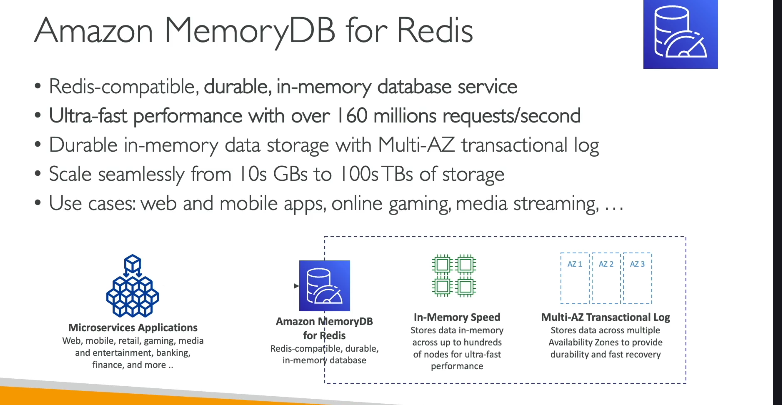

# Amazon MemoryDB for Redis – Tổng Quan & So Sánh với Redis

## 1. MemoryDB for Redis là gì?

- **Amazon MemoryDB for Redis** là một dịch vụ cơ sở dữ liệu in-memory, tương thích API Redis, được quản lý hoàn toàn bởi AWS.
- Được thiết kế **không chỉ là cache** như Redis truyền thống mà còn là một **database thực thụ** với khả năng **lưu trữ bền vững (durable)**.

---

## 2. So sánh Redis vs. MemoryDB for Redis

| Đặc điểm           | Redis (thường dùng với ElastiCache)   | MemoryDB for Redis                                      |
| ------------------ | ------------------------------------- | ------------------------------------------------------- |
| **Mục tiêu chính** | Cache, tốc độ, một phần durability    | Database, durability cao                                |
| **API**            | Redis                                 | Redis-compatible                                        |
| **Tính bền vững**  | Chủ yếu dựa vào snapshot, replication | Multi-AZ transaction log, durability thực sự            |
| **Phục hồi**       | Chậm hơn, có thể mất mát dữ liệu      | Nhanh, phục hồi mạnh mẽ nhờ Multi-AZ                    |
| **Tốc độ**         | Cực nhanh (in-memory)                 | Cực nhanh (in-memory), hỗ trợ hàng trăm triệu request/s |
| **Quy mô**         | Vài GB đến vài TB                     | Từ vài chục GB tới hàng trăm TB                         |

---

## 3. Tính năng nổi bật của MemoryDB for Redis

- **Hiệu năng cực cao**: >160 triệu requests/s.
- **In-memory**: Mọi thao tác đọc/ghi đều trên RAM.
- **Durable**: Dữ liệu được lưu lại qua Multi-AZ transaction log (gần như không mất mát dữ liệu).
- **Multi-AZ**: Tự động nhân bản dữ liệu qua nhiều vùng sẵn sàng (AZ), đảm bảo khả năng phục hồi sau sự cố.
- **Tương thích ứng dụng Redis**: Sử dụng Redis client, lệnh, data structure như Redis gốc.

---

## 4. Use Case tiêu biểu

- **Web & mobile apps** cần in-memory database vừa nhanh vừa bền vững.
- **Online gaming**, **media streaming**: Xử lý lượng request lớn, yêu cầu downtime cực thấp.
- **Microservices**: Nhiều dịch vụ cùng truy cập, cần tốc độ & phục hồi nhanh.
- **Bất kỳ hệ thống nào cần Redis API, nhưng muốn bảo toàn dữ liệu (durability) như database thực sự.**

---

## 5. Khi nào nên dùng MemoryDB for Redis?

- Khi bạn cần **Redis API** nhưng muốn bảo đảm **durability và high availability** hơn mức cache thông thường.
- Khi bạn cần **khả năng mở rộng lớn** (scale tới hàng trăm TB).
- Khi hệ thống của bạn yêu cầu **tốc độ**, **phục hồi nhanh**, **multi-AZ**, và **không được mất dữ liệu**.

---

## 6. Tóm tắt cho kỳ thi AWS

- MemoryDB for Redis = Redis API + In-memory + Durable (Multi-AZ transaction log)
- Dùng cho use case cần: tốc độ, độ bền dữ liệu, khả năng phục hồi, high availability.
- Không chỉ là cache, mà là một database có thể dùng lưu trữ chính.
- Phục hồi cực nhanh khi có sự cố nhờ Multi-AZ.

---

**Bạn cần một Redis-in-memory database vừa siêu nhanh, vừa bền vững, vừa phục hồi cực tốt? Hãy chọn Amazon MemoryDB for Redis!**
